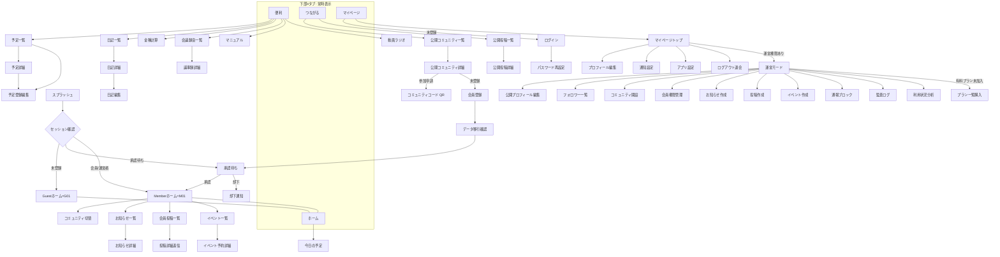
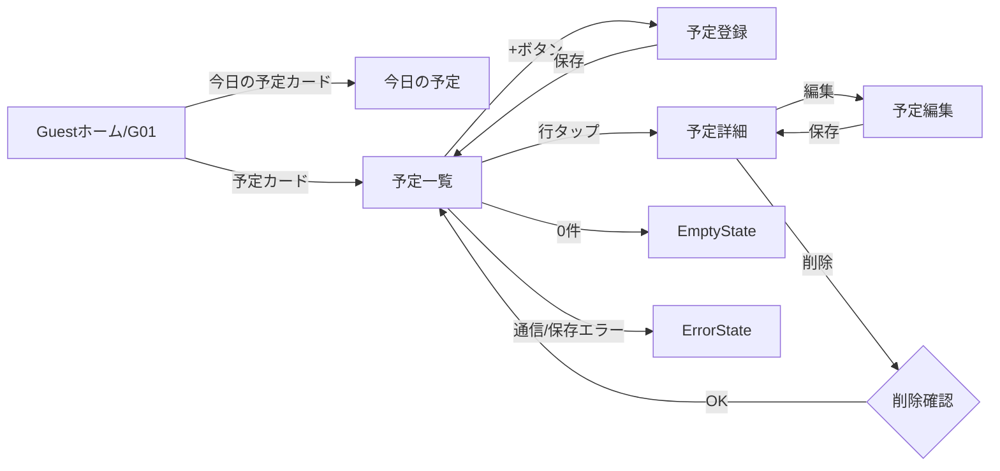
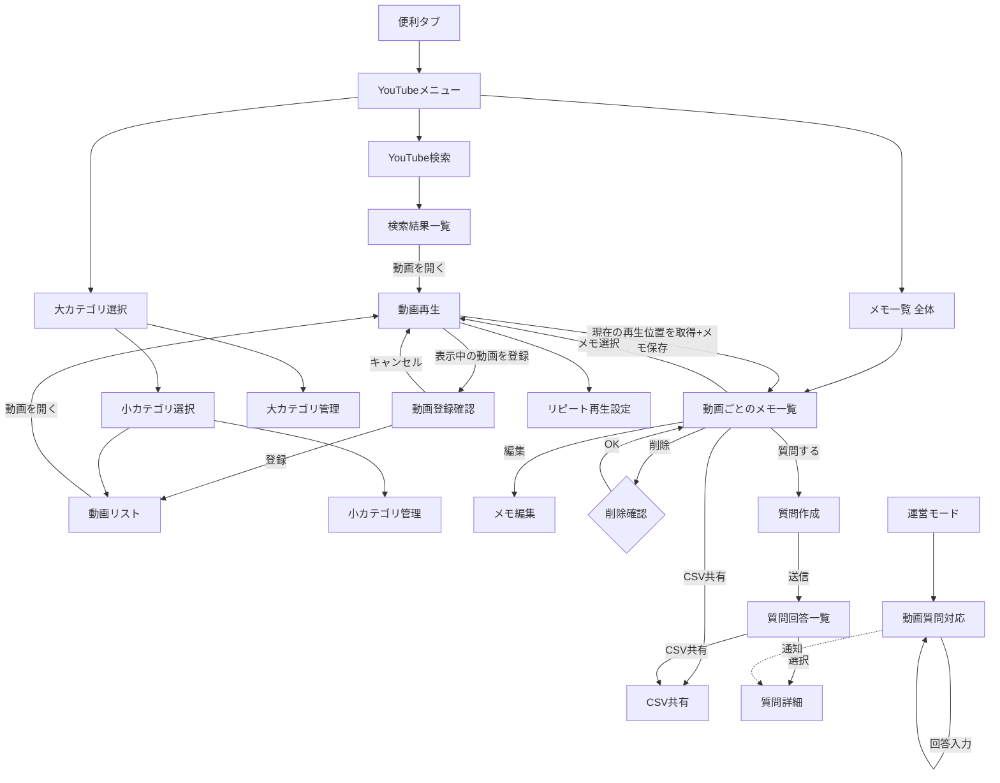
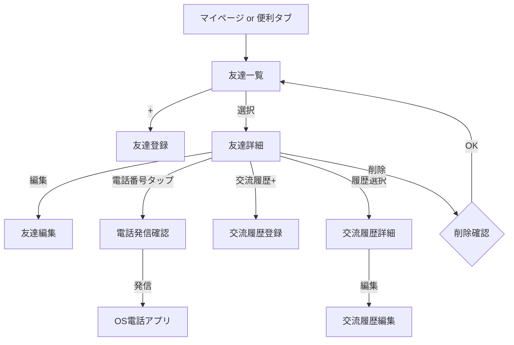

# 次期会員アプリ（iPhone・Android）設計資料

出典: GitHub Issue #1「[Next App] 次期会員アプリ（iPhone・Android）のモジュール方式による新規開発」
（komehyappyouniversity-sys/org-portal-project）

本資料は、実装担当（Codex）がそのまま作業計画・タスク分解を作成できるよう、issue #1 の内容を整理・具体化したものです。実装・GitHubへの書き込みは本資料の作成時点では行っていません。

---

## 0. 最上位の確定条件：Android・iPhone完全共通

本資料に記載する**すべての機能**は、次の条件を最上位の確定方針として遵守する。以降の全セクションはこの条件を前提とする。

- 次期アプリに搭載する全機能は、Android版・iPhone版で共通とする
- 片方のOSだけに存在する機能を作らない
- 機能名、利用条件、権限、データ項目、保存先、エラー仕様、完了条件を両OSで共通化する
- Android版またはiPhone版の**現行アプリ**にのみ存在する機能（例: iPhone版のみにある結合カテゴリ形式など）も、次期版では両OSに実装する
- OSによる違いは、標準UIコンポーネント、権限リクエスト画面、共有（シェア）画面、ファイル保存方法など、**実装方法のみ**に限定する。機能そのもの・データ項目・判定結果は差を設けない
- AndroidはJetpack Compose（Android標準の宣言的UIフレームワーク）、iPhoneはSwiftUIで実装し、各OSの標準的な操作感に合わせる
- 各機能に、Android・iPhone共通の受け入れテスト項目を用意する（「13. 両OS共通の受け入れテスト」参照）
- 機能ごとに両OSの対応状況を確認できる「機能パリティ表」を作成し、常に最新化する（「15.2 機能パリティ表」参照）
- **片方のOSだけで実装済みの状態を、その機能の完成とは判定しない**。両OSでの実装・テスト完了をもって完成とする

---

## 1. アプリの目的と対象利用者

### 1.1 目的

現行の会員アプリ（iPhone版・Android版）を直接改修するのではなく、両OSとも**新規プロジェクト**として次期会員アプリを開発する。現行アプリは動作確認・Firebase仕様確認用の参照としてのみ残し、次期版のソースコードは現行の巨大な画面・状態管理・Repositoryファイルをコピーしない（ゼロから設計し直す）。

一つの共通基盤（Core）の上に、機能を独立した部品（Featureモジュール）として積み上げる方式を取り、利用者の状態（未登録／会員／運営者）に応じてアプリの機能が段階的に増えていく構成にする。

### 1.2 対象利用者（3種類）

| 利用者区分 | 説明 |
|---|---|
| Guest（ゲスト） | 会員登録していない利用者。アプリをダウンロードしただけで一部機能が使える |
| Member（会員） | 会員登録し、いずれかのコミュニティに参加承認された利用者 |
| Creator / Owner / Manager（発信者・運営者） | コミュニティを開設・運営したり、公開投稿でファンを形成したりする利用者。有料管理プランの対象 |

※ Creator（発信者）、Owner（コミュニティ開設者）、Manager（運営を任された管理者）は権限レベルが異なるが、いずれも「運営側の機能」を使う点で1.2表ではまとめて扱う。権限の詳細は「8. ログイン・権限・セキュリティ」を参照。

---

## 2. 3段階に成長するアプリ形態

アプリは同一バイナリの中で、利用者の状態に応じて使える機能が段階的に増える。画面を総入れ替えするのではなく、ホーム画面にカードや入口が追加されていくイメージ。

### 段階1: 未登録でも使える「便利アプリ」（Guest）

会員登録なしで使える単体機能を提供し、まず実用性で使ってもらう段階。

- 予定・今日の予定
- 日記・写真日記
- 金種計算（主機能は配布額から必要金種を逆算する「金種分配計算」、副機能は紙幣・硬貨の枚数から合計金額を計算する「現金集計」）
- 会議録音・議事録
- SNS共有
- お気に入り
- 端末内保存（Firebaseを使わず、端末のローカルストレージにのみデータを保存する状態）

### 段階2: 会員登録・コミュニティ参加後に「交流機能」が加わるアプリ（Member）

会員登録し、コミュニティ（自治会・サークル・団体などの単位と想定）に参加承認されると、以下が使えるようになる。

- お知らせの閲覧・既読管理
- 会員投稿・管理者からの返信
- 公開投稿・添付ファイルの閲覧
- マニュアル閲覧
- 動画・ラジオ視聴
- イベント予約
- プッシュ通知の受信

### 段階3: 「発信・ファン形成・コミュニティ運営」ができる有料管理アプリ（Creator / Owner / Manager）

情報発信者やコミュニティ運営者向けに、有料プランで以下が使えるようになる。

- 公開プロフィール、フォロー・ファン機能
- コミュニティの新規開設
- 会員・権限管理
- お知らせ・投稿・イベントの作成／管理
- 通報・ブロック・監査対応
- 利用状況分析

### 段階間のデータ引き継ぎ

Guestとして使っていたデータ（予定・日記など）は、会員登録した際に端末内保存からFirebase側のデータへ引き継ぐ（詳細は「7. Firebaseの既存データを引き継ぐ方針」および「9. 最初に実装する範囲」参照）。

---

## 3. iPhone版・Android版の共通UI設計

### 3.1 基本方針

- iPhoneとAndroidで**情報構造・画面遷移・文言・状態表示は共通化**する
- 操作感（スワイプ、戻る動作、リストの見た目など）は各OSの標準UIパターンに合わせる（iPhoneはHuman Interface Guidelines、AndroidはMaterial Designに準拠）
- 機能追加時に画面全体を作り直さず、ホーム画面のカードとマイページ内の入口を段階的に追加していく設計にする
- 会員登録を最初に強制せず、便利機能を使った文脈の中で自然に案内する

### 3.2 基本ナビゲーション（4タブ、常に固定）

利用段階（Guest / Member / Creator等）が変わっても、下部タブ構成そのものは変えない。タブ内に表示される項目（カード等）が増減する。

1. **ホーム** — 利用者の状態に応じたカード（予定、お知らせ、フォロワー状況など）を表示
2. **便利** — 予定、日記、金種計算、会議録音など単体ツール機能の一覧
3. **つながる** — 公開コミュニティ・公開投稿の閲覧、コミュニティ切替、コミュニティサーフィン（コミュニティを探して参加する機能）
4. **マイページ** — プロフィール、設定、データ移行、（権限があれば）運営モードへの入口

### 3.3 利用者段階ごとのホーム構成

| 段階 | ホーム上部 | ホーム主要カード |
|---|---|---|
| Guest | なし（会員登録導線は控えめに表示） | 今日の予定、日記、金種計算、会議録音 |
| Member | 選択中コミュニティの切替UI | 未読お知らせ、直近イベント、最近の投稿。Guest時のカードは残す |
| Creator/Owner/Manager | 同上 | 上記に加え、公開投稿作成、フォロワー状況、コミュニティ運営への入口 |

管理画面（運営モード）は通常利用画面と混在させず、マイページから独立した「運営モード」に入る形にする。管理権限を持たない利用者には、管理系メニュー項目自体を非表示にする（グレーアウトではなく非表示）。

### 3.4 共通UIコンポーネント

Codexは以下を共通コンポーネントとして最初にCore/DesignSystemモジュール配下に実装し、各Feature画面から再利用する。

| コンポーネント名 | 役割 |
|---|---|
| FeatureCard | ホーム画面等で機能への入口として使うカード型UI |
| CommunitySwitcher | 参加中コミュニティの切替UI |
| PrimaryActionButton | 画面内の主要アクション（登録・保存等）ボタン |
| StatusBadge | 承認待ち・却下・公開中などの状態を示すバッジ |
| EmptyState | データが0件のときの表示 |
| ErrorState / Retry | 通信エラー時の表示と再試行ボタン |
| LoadingState | 読み込み中の表示 |
| PermissionRequiredState | 権限不足で機能が使えないことを示す表示 |
| OfflineBanner | オフライン状態であることを示すバナー |

### 3.5 デザイン・アクセシビリティ基準

- ブランドカラーは落ち着いたグリーンを基調とし、機能ごとに色を増やしすぎない（色数を抑えて一貫性を保つ）
- OSの文字サイズ変更設定、ダークモード、高コントラストモードに対応する
- タップ領域は iPhone 44pt以上／Android 48dp以上を確保する（pt・dpはそれぞれのOSにおける論理的な長さの単位）
- 状態（成功・エラー・警告など）を色だけで表現せず、必ず文字またはアイコンを併用する（色覚特性への配慮）
- 削除・退会・解約など重要な操作には、確認画面と処理結果画面を必ず設ける

---

## 4. 画面一覧と各画面の役割

画面IDは実装時の画面名・テストID命名のベースとして使用することを想定。

### 4.1 共通・起動系

| ID | 画面名 | 役割 | 利用可能段階 |
|---|---|---|---|
| S00 | スプラッシュ | 起動時のロゴ表示、初期化処理（セッション確認等） | 全員 |
| S01 | EmptyState | データ0件時の共通表示（部品） | 全員 |
| S02 | ErrorState/Retry | エラー時の共通表示（部品） | 全員 |
| S03 | LoadingState | 読み込み中の共通表示（部品） | 全員 |
| S04 | PermissionRequiredState | 権限不足時の共通表示（部品） | 全員 |
| S05 | OfflineBanner | オフライン時の共通バナー（部品） | 全員 |

### 4.2 便利（Guest向けツール、Featureモジュール: Tools）

| ID | 画面名 | 役割 |
|---|---|---|
| G01 | Guestホーム | 便利機能への入口カード一覧 |
| G02 | 予定一覧 | 登録済み予定の一覧表示 |
| G03 | 予定登録・編集 | 予定の新規作成・編集フォーム |
| G04 | 予定詳細 | 予定1件の詳細表示、編集・削除への導線 |
| G05 | 今日の予定 | 当日の予定のみを抽出した表示（ホームカードから直接遷移） |
| G06 | 日記一覧 | 日記・写真日記の一覧 |
| G07 | 日記登録・編集 | 日記本文・写真の登録編集フォーム |
| G08 | 日記詳細 | 日記1件の詳細表示 |
| G09 | 金種計算 | 「金種分配計算」と「現金集計」の入口。分配記録の保存・編集・削除、CSV/PDF共有、バックアップ入出力を含む |
| G10 | 会議録音一覧 | 録音済みファイルの一覧 |
| G11 | 会議録音詳細・議事録 | 録音の再生、議事録テキストの表示・編集 |
| G12 | お気に入り一覧 | Guest/Member共通のお気に入り登録一覧 |
| G13 | SNS共有（モーダル） | OS標準の共有シートを呼び出す |
| G14 | 端末内保存設定 | ローカル保存データの確認・管理 |

### 4.3 つながる（Community / Content）

| ID | 画面名 | 役割 | 利用可能段階 |
|---|---|---|---|
| C01 | 公開コミュニティ一覧 | 公開設定のコミュニティを探す一覧（コミュニティサーフィン） | Guest以上 |
| C02 | 公開コミュニティ詳細 | コミュニティ概要と参加導線 | Guest以上 |
| C03 | 公開投稿一覧 | 公開投稿のフィード | Guest以上 |
| C04 | 公開投稿詳細 | 投稿本文・添付・フォローボタン | Guest以上 |
| C05 | コミュニティ切替 | 参加中の複数コミュニティの切替 | Member以上 |

### 4.4 アカウント・登録系（Featureモジュール: Account）

| ID | 画面名 | 役割 |
|---|---|---|
| A01 | 会員登録 | メールアドレス・パスワード等の登録フォーム |
| A02 | ログイン | 既存アカウントでのログイン |
| A03 | パスワード再設定 | 再設定メール送信フロー |
| A04 | 承認待ち | コミュニティ参加申請中であることの表示 |
| A05 | 却下通知 | 参加申請が却下された場合の表示 |
| A06 | コミュニティコード入力・QRスキャン | 招待コード/QRコードでの参加申請 |
| A07 | データ移行確認 | Guest時のローカルデータをMemberデータへ引き継ぐか確認する画面 |

### 4.5 会員機能（Featureモジュール: Messages, Content, Posts）

| ID | 画面名 | 役割 |
|---|---|---|
| M01 | Memberホーム | 会員向けホーム（3.3参照） |
| M02 | お知らせ一覧 | コミュニティからのお知らせ一覧、既読/未読管理 |
| M03 | お知らせ詳細 | お知らせ本文表示 |
| M04 | 会員投稿一覧 | コミュニティ内投稿の一覧 |
| M05 | 会員投稿詳細・返信 | 投稿詳細、管理者からの返信表示 |
| M06 | マニュアル一覧・詳細 | コミュニティのマニュアル閲覧 |
| M07 | 動画・ラジオ一覧・再生 | メディアコンテンツの一覧と再生 |
| M08 | イベント一覧 | コミュニティ主催イベントの一覧 |
| M09 | イベント予約・詳細 | イベント詳細確認と予約操作 |

### 4.6 マイページ共通

| ID | 画面名 | 役割 |
|---|---|---|
| P01 | マイページトップ | プロフィール要約、設定・運営モードへの導線 |
| P02 | プロフィール編集 | 表示名・アイコン等の編集 |
| P03 | 通知設定 | プッシュ通知の受信設定 |
| P04 | アプリ設定 | テーマ・文字サイズ等の表示設定 |
| P05 | ログアウト・退会 | ログアウトおよび退会（アカウント削除）の確認フロー |

### 4.7 発信者・運営（Featureモジュール: Creator, CommunityAdmin）

| ID | 画面名 | 役割 |
|---|---|---|
| R00 | 運営モード切替 | マイページから運営者向け画面群への入口 |
| R01 | 公開プロフィール編集 | Creatorとしての公開プロフィール編集 |
| R02 | フォロワー一覧 | フォロワー・ファンの一覧 |
| R03 | コミュニティ開設ウィザード | 新規コミュニティ作成の複数ステップフォーム |
| R04 | 会員・権限管理一覧 | コミュニティ内会員の権限変更、承認/却下操作 |
| R05 | お知らせ作成・編集 | 運営者によるお知らせ作成 |
| R06 | 投稿作成・編集 | 会員投稿への返信、公開投稿の作成 |
| R07 | イベント作成・編集 | イベントの新規作成・編集 |
| R08 | 通報・ブロック一覧 | 通報内容の確認、ブロック操作 |
| R09 | 監査ログ | 運営操作の履歴確認 |
| R10 | 利用状況分析ダッシュボード | コミュニティの利用状況の可視化 |

### 4.8 有料プラン（Featureモジュール: Billing、Phase 6）

| ID | 画面名 | 役割 |
|---|---|---|
| B01 | プラン一覧・購入 | 有料プランの比較と購入（ストア課金） |
| B02 | 購入復元 | 既存購入の復元処理 |
| B03 | 解約手続き | 解約導線（ストア設定画面への誘導含む） |

---

## 5. 画面遷移

### 5.1 全体のナビゲーション構造



### 5.2 最初の実装対象「予定」機能の詳細遷移



### 5.3 遷移設計の原則

- 下部タブは常時表示のまま、各タブ内でスタック型（積み上げ型）の画面遷移を行う
- 一覧→詳細→編集の3階層を基本パターンとし、Feature間で統一する
- 権限がない画面への遷移リンクは表示しない（403的なエラー画面に到達させる設計にしない）
- 削除・退会・解約など不可逆操作の前には必ず確認ダイアログを挟む

---

## 6. 共通基盤と各機能モジュールの分け方

### 6.1 モジュール分割の考え方

iPhone（SwiftUIによるXcodeプロジェクト）、Android（Gradleマルチモジュール、複数の独立したビルド単位に分けるAndroidの標準的な構成方法）とも、以下の論理構成を共通言語として使う。名称はiPhone/Android双方で揃える。

### 6.2 Core（共通基盤）モジュール

| モジュール名 | 役割 |
|---|---|
| Model | アプリ全体で使うDomain Model（後述）の型定義 |
| DesignSystem | 3.4節の共通UIコンポーネント、配色・文字サイズ等のデザイントークン |
| Navigation | 画面遷移の管理（5節の遷移構造を実装） |
| Session | ログイン状態・現在の利用者段階・選択中コミュニティの保持 |
| Data | Firebase（Firestore, Auth, Storage等）や端末内保存へのアクセスをすべてここに集約 |
| Notifications | プッシュ通知の送受信・権限リクエストの共通処理 |
| Testing | 単体テスト用のモックデータ・テストユーティリティ |

### 6.3 Feature（機能）モジュール

| モジュール名 | 対応する画面群（4節） |
|---|---|
| Tools | G01〜G14（予定、日記、金種計算、会議録音等） |
| Account | A01〜A07（登録・ログイン・承認フロー） |
| Community | C01〜C05（公開コミュニティ、コミュニティ切替） |
| Messages | M02〜M03（会員向けメッセージ＝お知らせ機能。運営者から会員全員・カテゴリ対象・個別会員へ送信する一方向配信。会員同士のDMではなく、初期版でDMは実装しない。2026-07-23確定） |
| Content | M06、M07（マニュアル、動画・ラジオ） |
| Posts | M04、M05、C03、C04（会員投稿・公開投稿） |
| Creator | R01、R02（公開プロフィール、フォロワー） |
| CommunityAdmin | R03〜R09（コミュニティ運営、会員管理、通報対応） |
| Billing | B01〜B03（有料プラン） |

### 6.4 依存関係のルール（Codexが実装時に厳守する制約）

1. **App**（アプリ本体のエントリーポイント）が Core と Feature を組み合わせる。Feature単体・Core単体はビルドできても、依存関係の起点は必ずApp。
2. **Feature は自分が必要な Core モジュールにのみ依存する**（例: Tools は Data と Model には依存するが、Notifications が不要なら依存させない）。
3. **Feature同士は直接依存させない**。ある機能から別の機能のデータが必要な場合は、Coreの Model / Data 層を経由する。
4. **Firebase SDKの実装コードはData層にのみ書く**。Feature層・UI層からFirestore/Auth等のSDKを直接importしない。
5. **UI層はFirestoreの `DocumentSnapshot` や辞書型（Dictionary）を直接受け取らない**。Data層で必ずDomain Modelに変換してからUIへ渡す。

### 6.5 Domain Modelとは

「Domain Model」とは、Firebaseの生データ構造（Firestoreのフィールド名や型）に依存しない、アプリのビジネスロジック上の型定義のこと。例えば「予定」であれば `Schedule(id, title, date, memo, isAllDay, ...)` のような形で、iPhone（Swift の struct）・Android（Kotlin の data class）それぞれの言語で対応する型を用意し、フィールド名・意味を完全に一致させる。Firestore側のフィールド名が将来変わっても、Domain Modelの形を保てばUI側の変更は不要、という構造にするのが目的。

---

## 7. Firebaseの既存データを引き継ぐ方針

### 7.1 基本方針

既存データを新しいFirebaseプロジェクトへコピーするのではなく、**正式版（本番）では現行と同じFirebaseプロジェクトをそのまま利用する**。これにより会員データ・コミュニティデータを失わずに新アプリへ移行できる。

### 7.2 Legacy Adapter

次期アプリのDomain Modelと、既存Firestoreの構造（フィールド名の付け方や、値が欠けているデータが混在している状態）との間に「Legacy Adapter」という変換層を置く。Legacy AdapterはData層（6.2節）の内部に実装し、以下を吸収する。

- 旧フィールド名 → 新Domain Modelのフィールド名への変換
- 値が欠損している場合のデフォルト値補完
- 型が揺れているデータ（文字列で保存された数値など）の正規化

将来的にFirestore側のデータ構造を整理し直す場合も、Legacy Adapterの変換ルールを更新するだけでUI・ビジネスロジック側には影響が出ない構造にする。

### 7.3 プッシュ通知トークンの扱い

プッシュ通知トークンは新アプリで新規に取得し直し、以下の情報とセットで保存する。

- UID（利用者を一意に識別するID）
- アプリ種別（次期版であることの識別子）
- 実行環境（開発／本番）
- 更新日時

旧アプリのトークンをそのまま引き継ぐことはしない（新アプリのBundle ID/applicationIdが異なるため、トークン自体も別物になる）。

### 7.4 開発時の安全策

- 開発版アプリ（下記アプリIDを使用）は**本番Firebaseへ書き込みを行わない**
- 開発中の動作確認は開発用のFirebase環境、またはエミュレータ等の書き込みが本番に影響しない環境で行う（具体的な開発環境の構築方法は「11. 設計上、私が判断する必要がある項目」参照）

### 7.5 アプリID一覧

| 対象 | 開発版 | 本番版 |
|---|---|---|
| iPhone | `org.nagaoka.blog.k100.member.next` | `org.nagaoka.blog.k100.member` |
| Android | `jp.komehyappyo.member.next` | `jp.komehyappyo.member` |

開発版は本番版と別IDのため、同一端末に現行版アプリと開発版アプリを同時にインストールして比較確認できる。本番配信時は現行アプリと同じID・正式な署名を使用し、ストア上は「既存アプリのアップデート」として配信する（新規アプリとしての公開ではない）。

---

## 8. ログイン・権限・セキュリティ

### 8.1 認証

Firebase Authenticationを使用し、以下のフローを実装する。

- 会員登録（メールアドレス／パスワード方式を基本とする。SNS連携等の要否は11節参照）
- ログイン
- パスワード再設定

### 8.2 コミュニティ参加フロー

1. 利用者がコミュニティコード入力またはQRコードスキャンで参加申請（画面A06）
2. 申請後は「承認待ち」状態（画面A04）となり、運営者の承認を待つ
3. 運営者が承認 → Member状態でコミュニティ機能が使えるようになる
4. 運営者が却下 → 却下通知（画面A05）を表示

### 8.3 権限モデル

| 権限 | 説明 | 主な操作範囲 |
|---|---|---|
| Guest | 未登録利用者 | 端末内保存の便利機能、公開コンテンツの閲覧のみ |
| Member | 参加承認済み会員 | コミュニティ内のお知らせ・投稿・イベント閲覧、投稿への参加 |
| Creator | 公開プロフィールで発信する利用者 | 公開投稿の作成、フォロワー管理（コミュニティ運営権限とは独立） |
| Manager | 運営者から権限を委譲された管理者 | 委譲された範囲内でのお知らせ・投稿・イベント管理 |
| Owner | コミュニティ開設者 | 会員承認、権限管理、通報対応、コミュニティ設定変更を含む全権限 |

Manager/Ownerの権限差は、Ownerがコミュニティ設定・他の管理者への権限付与まで行える点。Managerは委譲された範囲（例: お知らせ作成のみ許可、会員管理は不可、等）に限定される想定。**委譲可能な権限の粒度をどこまで細かくするかは11節で判断が必要。**

### 8.4 Firebase Security Rulesとの整合

アプリ内の権限判定（画面表示・操作可否）と、Firebase Security Rules（Firestore/Storageへのアクセスをサーバー側で制御するルール）は必ず一致させる。アプリ側で非表示にしているだけで、Security Rules側で防いでいない操作があってはならない（アプリ側のUI制御はあくまで利便性のためであり、実際のデータ保護はSecurity Rulesが担保する、という原則をCodexは実装時に徹底する）。

### 8.5 開発時のセキュリティ

- 開発版と本番版でFirebaseプロジェクト（またはFirebase環境）を分離し、開発版が本番データへ書き込めない構成にする
- 有料プラン購入は「サーバー側購入検証」を行う（ストアからの購入完了通知をクライアント側だけで信頼せず、サーバー側で検証してから権限を付与する。詳細はPhase 6・11節参照）

---

## 9. 最初に実装する範囲

Issue #1で指定されている「最初の実装対象」は、Phase 2の最初の機能である**Guest向け「予定」機能**。

### 9.1 実装スコープ

| 項目 | 内容 |
|---|---|
| 共通仕様とDomain Model | iPhone/Android共通の `Schedule` 型定義（id, タイトル, 日付, 終日フラグ, メモ等） |
| 端末内保存 | Firebaseを使わず、端末ローカルにのみ保存（iPhoneはSwiftData、AndroidはRoomを使用。詳細は15.15.1） |
| 一覧・登録・編集・削除 | 画面G02〜G04、5.2節の遷移に対応するCRUD操作 |
| 今日の予定 | 当日分のみを抽出する表示（画面G05） |
| 空・エラー状態 | 共通コンポーネント S01（EmptyState）、S02（ErrorState）を予定機能に適用 |
| iPhone/Androidの単体テスト | Domain Modelのロジック、保存・取得処理に対するテストコード |

### 9.2 完了の目安（この範囲における）

- Guestが会員登録なしで予定の一覧表示・登録・編集・削除ができる
- 今日の予定がホーム/G05から確認できる
- 0件時・エラー時に適切な状態表示が出る
- iPhone/Android双方で同じ入力バリデーション・同じ挙動になる
- 単体テストがCIで実行できる状態になっている

### 9.3 スコープ外（今回は着手しない）

- Firebaseへの同期（会員登録後のデータ移行は9.1の対象外で、A07画面の実装と合わせて別スコープとする）
- 繰り返し予定、通知（リマインダー）機能（要否は11節で判断）

---

## 10. 完了条件とテスト項目

### 10.1 プロジェクト全体の完了条件（Issue #1より）

- [ ] iPhone・Androidで同じ利用者状態と権限判定になる
- [ ] Guestが会員登録なしで便利機能を利用できる
- [ ] 会員登録後にコミュニティ機能が追加される
- [ ] Creator / Owner / Managerに必要な機能だけが追加される
- [ ] Firebase Security Rulesとアプリ内権限が一致する
- [ ] 開発版が本番Firebaseへ誤接続しない
- [ ] 既存会員データを維持して本番更新できる
- [ ] 現行アプリの旧ソースコードへ依存していない
- [ ] 両OSのビルド・主要テストがCIで成功する

### 10.2 テスト項目（Codexが実装時に用意するテストの目安）

| 分類 | テスト内容 |
|---|---|
| 単体テスト（Domain Model） | Schedule等の各Modelのバリデーション、変換ロジック |
| 単体テスト（Data層） | Legacy Adapterの変換ロジック（旧フィールド→新フィールド、欠損値補完） |
| 単体テスト（権限判定） | Guest/Member/Creator/Owner/Managerごとの操作可否ロジック |
| UIテスト（最低限） | 予定機能のCRUD操作が画面上で成立すること（一覧→詳細→編集→保存の往復） |
| 結合テスト | Firebase Auth連携（承認待ち→承認→Member遷移） |
| セキュリティテスト | アプリ内権限とFirebase Security Rulesの不一致がないこと（Rules単体のテストを含む） |
| 環境分離テスト | 開発版ビルドが本番Firebaseに書き込みを行わないことの確認 |
| CI | iPhone/Android双方の基本ビルドとテストがCI上で自動実行されること |

### 10.3 段階的な受け入れ確認

Phase単位（Phase 2〜6）ごとに、そのPhaseの完了条件チェックリスト（issue本文のPhase別チェックリストに準拠）を満たしたことを確認してから次Phaseへ進む運用を想定。

---

## 11. 設計上、私が判断する必要がある項目

以下はissue #1本文だけでは決まっていない、または複数の選択肢が考えられる事項でした。**2026-07-23時点ですべて根津さんからの回答により確定しています**（15.15節に詳細を集約）。原文は履歴として残す。

1. ~~端末内保存の採用技術~~ → 15.15.1で確定（iPhone: SwiftData、Android: Room。DataStoreは設定値専用）
2. ~~予定機能の詳細仕様~~ → 15.15.2で確定（繰り返し予定・リマインダー・カテゴリ分けすべて実装）
3. ~~金種計算の対象~~ → 15.15.3で確定（日本円・全金種対象）
4. ~~会議録音の仕様~~ → 15.15.4で確定（初期版は外部APIなし、OS標準の端末内音声認識のみ）
5. ~~Legacy Adapterの具体的なフィールドマッピング~~ → 12.5（配信動画・個人動画）で判明分は反映済み。調査ルールは15.15.5、残る全件調査は15.14参照
6. ~~開発時のFirebase書き込み防止の具体的な実装方式~~ → 15.15.6で確定（Emulator Suite＋別開発用プロジェクトの二段構成）
7. ~~Manager権限の委譲粒度~~ → 15.15.7で確定
8. ~~有料プランの価格・プラン体系~~ → 15.15.8で確定（無料／運営者Proの2段階。価格は月額1,980円・年額19,800円で確定、Remote Configで変更可能な設計）
9. ~~ストア課金のサーバー検証方式~~ → 15.15.9で確定
10. ~~通報・ブロック機能の運用ルール~~ → 15.15.10で確定
11. ~~多言語対応の要否~~ → 15.15.11で確定（初期は日本語のみ）
12. ~~退会時のデータ取り扱い~~ → 15.15.12で確定
13. ~~CI基盤~~ → 15.15.13で確定（GitHub Actions）
14. ~~ストア審査・段階公開の進め方~~ → 15.15.14で確定

---

## 12. 動画メモ・質問・YouTube検索登録・カテゴリ管理機能（既存機能の引き継ぎ）

現行アプリに存在する「視聴動画メモ保存」「動画に関する質問」「YouTube検索・登録」「2段階カテゴリ」機能を、次期アプリへ共通仕様として引き継ぐ。本節はiPhone/Android共通の設計であり、実装・GitHubへの反映は行わない。

### 12.1 対象範囲

| 機能 | 概要 |
|---|---|
| 動画メモ保存 | 配信動画・個人登録YouTube動画の任意の再生位置にメモを残す |
| 動画に関する質問 | 保存済みメモを元に、コミュニティ管理者へ質問を送信する |
| YouTube検索 | アプリ内でYouTubeを検索し、動画を登録候補として開く |
| YouTube動画登録 | 検索結果や外部から開いたYouTube動画を、大/小カテゴリ付きで個人領域に登録する |
| 2段階カテゴリ管理 | 大カテゴリ・小カテゴリの2階層でカテゴリを管理し、既存の1階層categoryを移行する |

対象動画は、(1) コミュニティ・運営者が配信する動画（YouTube/Vimeo）、(2) 利用者本人が登録するYouTube動画、の2系統。メモ機能は両方に対応するが、検索・登録機能（12.4/12.5）はYouTubeのみを対象とする。

### 12.2 画面一覧

| ID | 画面名 | 役割 |
|---|---|---|
| V01 | YouTubeメニュー | 「YouTubeを検索」「登録一覧」「メモ一覧」の3項目への入口 |
| V02 | YouTube検索 | キーワード入力 |
| V03 | YouTube検索結果一覧 | アプリ内検索結果の一覧、動画再生ページへの導線 |
| V04 | 動画登録確認 | タイトル編集、大/小カテゴリ選択、URL・サムネイル確認、登録/キャンセル |
| V05 | 登録動画一覧（大カテゴリ選択） | 個人登録動画を大カテゴリ単位で表示 |
| V06 | 登録動画一覧（小カテゴリ選択） | 選択した大カテゴリ配下の小カテゴリを表示 |
| V07 | 登録動画一覧（動画リスト） | 選択した小カテゴリに属する動画の一覧 |
| V08 | 動画再生 | 配信動画・登録動画共通の再生画面。メモ機能・リピート再生設定を統合 |
| V09 | 動画ごとのメモ一覧 | 特定動画に紐づく全メモの一覧、メモ件数表示 |
| V10 | メモ編集 | 保存済みメモの再生位置・本文を編集 |
| V11 | メモ削除確認 | メモ削除前の確認ダイアログ |
| V12 | 質問作成 | メモを元にした質問本文の入力、送信先コミュニティの確認 |
| V13 | 動画質問・回答一覧 | 自分が送った質問の一覧、未回答/回答済みの区別表示 |
| V14 | 質問詳細 | 質問本文・管理者回答・回答日時の表示 |
| V15 | カテゴリ管理（大カテゴリ） | 大カテゴリの追加・編集・削除・並び替え |
| V16 | カテゴリ管理（小カテゴリ） | 選択した大カテゴリ配下の小カテゴリの追加・編集・削除・並び替え |
| V17 | CSV共有 | メモ一覧／質問一覧をCSVとしてOS標準共有シートへ渡すモーダル |
| V18 | リピート再生設定 | 動画再生画面内で呼び出す、リピート区間・回数設定パネル |

なお、管理者側の「質問への回答」画面（4.7節 R05〜R09相当の運営モード内）は本節の対象外とせず、次のIDを追加する。

| ID | 画面名 | 役割 |
|---|---|---|
| V19 | 動画質問対応（運営モード） | コミュニティ宛の未回答質問一覧、回答入力 |

### 12.3 画面遷移



### 12.4 基本操作フロー

**動画メモ保存**（issueの手順をそのまま踏襲）

1. 利用者が動画（V08）を再生する
2. メモを残したい場面で「現在の再生位置を取得」を押す
3. 「分:秒」形式で再生位置を表示する
4. 利用者がメモ本文を入力する
5. 「この位置にメモを保存」を押す
6. VideoMemoとして保存し、V09の一覧に反映する

**動画に関する質問**

1. V09のメモから「質問」を選ぶ（V12へ遷移）
2. メモの再生位置・本文を表示する
3. 質問本文を入力する
4. 送信先コミュニティ（動画の配信元コミュニティ、または対象コミュニティ）へ送信する
5. VideoQuestionを`unanswered`状態で保存する
6. 管理者が回答すると`answered`状態に更新し、質問者へ通知する

**YouTube検索・登録**

1. V01→V02でキーワード検索
2. V03の結果から動画を開く（V08）
3. 「表示中の動画を登録」→V04で大/小カテゴリを選択・タイトル編集
4. 登録確定でV07の一覧に反映（既存の同一YouTube動画IDがあれば新規作成せず更新）

### 12.5 データモデル

> 2026-07-23時点で以下12.5〜12.11は、根津さんからの回答（判断項目15〜27）を反映して確定仕様に更新している。旧`largeCategoryId`/`smallCategoryId`は`primaryCategoryId`/`secondaryCategoryId`に統一した。

#### DistributedVideo（配信動画・現行構造からの読み取り専用モデル）

コミュニティ・運営者が配信する動画。

```
organizations/{organizationId}/videos/{videoId}
```

> **2026-07-23 実データ調査済み**（Firebaseプロジェクト`ictnagaoka-member`、k100u組織の2文書で確認。個人情報・実際の値は転記していない）。以下が実際のフィールド構成であり、事前にコードから推測した構造（`url`/`link`/`youtubeVideoId`/`videoPlatform`/`organizationId`フィールド）とは異なっていた。

**実フィールド（確認できた18件、2文書で一致）**

| 現行フィールド | 型 | Domain Modelへの変換 |
|---|---|---|
| title | string | videoTitle |
| description | string | description（新規追加。事前推測にはなかった） |
| embedHtml | string | embedHtml（Vimeo等の埋め込みHTMLスニペット。新規追加） |
| videoUrl | string | videoUrl |
| vimeoUrl | string | vimeoUrl（新規追加。videoUrlとの使い分けは要確認、15.14残課題） |
| vimeoVideoId | string | providerVideoId、videoType=`distributed_vimeo` |
| thumbnailUrl | string | thumbnailUrl |
| sortOrder | integer | sortOrder（新規追加。一覧の並び順に使用） |
| category | string | primaryCategoryId（移行）、secondaryCategoryIdは「未分類」 |
| isPublished | boolean | 公開判定（`true`の動画のみ一覧・視聴対象とする） |
| isMembersOnly | boolean | 会員限定フラグ（Guestには非表示） |
| isPremium / price / priceText / billingType / productId | boolean/integer/string | 有料視聴関連（Billing・Phase6と連携。詳細は10節） |
| createdAt | timestamp | createdAt |
| updatedAt | timestamp | updatedAt（新規追加） |

**確認2文書には存在しなかったフィールド**: `url`、`link`、`youtubeVideoId`、`videoPlatform`、`organizationId`（`organizationId`はドキュメントパスから取得する設計で問題ない）

確認した2文書はいずれもVimeoの情報のみを持ち、YouTube側のフィールドは存在しなかった。videoTypeの判定は`vimeoVideoId`の有無を基本とし、将来ほかの組織のデータに何らかのYouTube識別フィールドが見つかった場合に備え、Legacy Adapterは未知のフィールド名にも耐えられる形（フィールド欠落時はnull扱いで処理を継続する）で実装する。

**Legacy Adapterの互換方針**: 次期版では上記18フィールドを読み込める互換アダプターを用意する。移行処理は原則として**フィールド欠落に耐えられる読み込み**とし（今回確認したのは2文書のみで、古い文書や別形式が他組織に存在する可能性があるため）、必須フィールドが欠落している場合は安全なデフォルト値（空文字・false・0など）にフォールバックする。

**質問（配信動画向け）**: `organizations/{organizationId}/videoQuestions/{questionId}`（VideoQuestionと同一。下記参照）

**個人登録動画**: `memberPrivate/{uid}/youtubeVideos/{youtubeVideoId}`（12.6参照）

#### VideoMemo（利用者専用データ）

| フィールド | 型 | 説明 |
|---|---|---|
| id | string | メモID |
| userId | string | 利用者ID（会員登録済みはFirebase Auth UID、未登録Guestは端末発行の匿名ID） |
| videoId | string | 動画の内部参照ID（配信動画/個人登録動画いずれかを指す） |
| videoTitle | string | 動画タイトル |
| videoUrl | string | 動画URL |
| thumbnailUrl | string | サムネイルURL |
| providerVideoId | string | YouTube動画IDまたはVimeo動画ID |
| videoType | enum | `distributed_youtube` / `distributed_vimeo` / `personal_youtube` / `personal_vimeo`（個人登録動画も実データ上はVimeoに対応しているため`personal_vimeo`を追加、12.5 PersonalVideo参照） |
| categoryNameSnapshot | string \| null | メモ保存時点のカテゴリ表示名（例:「健康 / 体操」）。通常表示は動画側の現在のカテゴリ（`videoId`経由でPersonalVideo/DistributedVideoを参照）を使用し、現在値と異なる場合のみ「保存時: ○○」を補足表示する |
| positionSeconds | number | 再生位置（秒） |
| memoText | string | メモ本文 |
| createdAt | timestamp | 保存日時 |
| updatedAt | timestamp | 更新日時 |
| sourceCommunityId | string \| null | 配信元コミュニティID（個人登録動画はnull） |
| syncStatus | enum | `synced` / `pendingSync`（オフライン作成時の同期状態。12.8参照） |

#### VideoQuestion

```
organizations/{organizationId}/videoQuestions/{questionId}
```

> **2026-07-23 実データ調査済み**（`ictnagaoka-member`、k100u組織で2文書＝回答済み1件・未回答1件を確認）。実フィールドは以下13件で一致した。

**実フィールド**: `answerText`(string) `answeredAt`(timestamp\|null) `createdAt`(timestamp) `memberEmail`(string) `memberName`(string) `memberUid`(string) `noteText`(string) `questionText`(string) `seconds`(integer) `status`(string: 未回答=`open`、回答済み=`answered`) `updatedAt`(timestamp) `videoId`(string) `videoTitle`(string)

未回答時は`answerText`が空文字、`answeredAt`が`null`、`status`が`open`。旧データには`organizationId`・`playbackSeconds`・`memoText`（新形式のフィールド名）は存在しなかった。

**Domain Model（新形式）と、Legacy Adapterのフォールバック**

| フィールド | 型 | 説明 |
|---|---|---|
| id | string | 質問ID |
| clientRequestId | string | クライアント発行の一意ID。オフライン下書き送信時の二重送信防止に使用（新規フィールド） |
| askerUserId | string | 質問者の利用者ID（旧`memberUid`） |
| askerName | string | 質問者名（旧`memberName`） |
| askerEmail | string | 質問者のメールアドレス（旧`memberEmail`） |
| communityId | string | 対象コミュニティID。旧データに`organizationId`フィールドがなければドキュメントパスから取得する |
| videoId | string | 動画の内部参照ID |
| videoTitle | string | 動画タイトル |
| positionSeconds | number | メモの再生位置。`playbackSeconds`があればそれを使用、なければ旧`seconds`を使用 |
| memoText | string | 元メモ本文。`memoText`があればそれを使用、なければ旧`noteText`を使用 |
| questionText | string | 質問本文 |
| status | enum | `unanswered` / `answered`（旧`open`は`unanswered`へ変換） |
| answerText | string \| null | 管理者の回答本文 |
| answeredByUserId | string \| null | 回答した管理者のID（旧データには対応フィールドなし。新規回答時のみ設定） |
| createdAt | timestamp | 質問日時 |
| updatedAt | timestamp | 更新日時（旧データにも存在） |
| answeredAt | timestamp \| null | 回答日時 |
| syncStatus | enum | `draft` / `sending` / `sent` / `failed`（オフライン送信の状態表示に使用。新規フィールド） |

質問の送信先コミュニティは、配信動画（`sourceCommunityId`あり）の場合は自動決定する。個人登録動画（配信元コミュニティがない）の場合は、送信前に利用者が所属コミュニティから選択する必須ステップを設ける（未選択のまま送信できないようにする）。

#### PersonalVideo（個人登録動画・利用者専用データ）

```
memberPrivate/{uid}/youtubeVideos/{youtubeVideoId}
```

> **2026-07-23 実データ調査済み**（`ictnagaoka-member`、3文書を確認、全件同一フィールド構成）。実データは**YouTubeだけでなくVimeoにも対応**しており（`videoPlatform`・`vimeoVideoId`・`youtubeVideoId`の3フィールドが揃って存在）、事前の想定（YouTube専用）は誤りだった。また、配信動画（DistributedVideo）と同じ課金関連フィールド（`billingType`/`isMembersOnly`/`isPremium`/`isPublished`/`price`/`priceText`/`productId`）が個人登録動画にも存在しており、用途は未確認（15.14残課題）。

**実フィールド（23件）**: `billingType`(string) `bookmarkTimestampSeconds`(integer) `category`(string) `channelName`(string) `createdAt`(timestamp) `isMembersOnly`(boolean) `isPremium`(boolean) `isPublished`(boolean) `note`(string) `originalUrl`(string) `price`(integer) `priceText`(string) `productId`(string) `tags`(array\<string\>) `thumbnailUrl`(string) `timestampSeconds`(integer) `timestampedUrl`(string) `title`(string) `updatedAt`(timestamp) `url`(string) `videoPlatform`(string) `vimeoVideoId`(string) `youtubeVideoId`(string)

ドキュメントIDには（現行データではYouTube動画の場合）YouTube動画IDが使われている。次期版でも同様に、`videoPlatform`に応じて`youtubeVideoId`または`vimeoVideoId`をドキュメントIDとして使用する（同じIDへの書き込みは新規作成ではなく上書き更新となり、重複登録防止に使える）。

**Domain Model**

| フィールド | 型 | 説明 |
|---|---|---|
| providerVideoId | string | YouTube動画IDまたはVimeo動画ID（ドキュメントIDと同値） |
| userId | string | 登録者の利用者ID |
| videoTitle | string | 動画タイトル（旧`title`、自動取得後に編集可） |
| channelName | string | チャンネル名（自動取得、既存フィールドと一致） |
| videoType | enum | `personal_youtube` / `personal_vimeo`（旧`videoPlatform`から変換） |
| videoUrl | string | 正規化済みURL（旧`url`） |
| originalUrl | string | 利用者が入力した元URL（既存フィールドと一致、正規化前の値として保持） |
| thumbnailUrl | string | サムネイルURL |
| savedPositionSeconds | number | 登録時点の再生位置（秒）。旧`bookmarkTimestampSeconds`と`timestampSeconds`の両方に対応し、両方存在する場合は`bookmarkTimestampSeconds`を優先する |
| timestampedUrl | string \| null | 再生位置付きURL（既存フィールドと一致。表示・共有用に保持） |
| primaryCategoryId | string | 大カテゴリID（旧`category`から移行） |
| secondaryCategoryId | string | 小カテゴリID（移行時は「未分類」） |
| note | string \| null | 任意メモ（既存フィールドと一致） |
| tags | string[] | タグ（既存フィールドと一致。登録画面ではカンマ区切り入力を配列へ変換） |
| createdAt | timestamp | 登録日時 |
| updatedAt | timestamp | 更新日時 |
| legacyCategory | string \| null | 移行元の旧`category`値（移行期間中のみ保持） |
| legacyCombinedCategory | string \| null | 移行元のiPhone版「結合カテゴリ形式」の値（移行期間中のみ保持。書式は12.9参照） |
| legacyBillingFields | object \| null | 旧`billingType`/`isMembersOnly`/`isPremium`/`isPublished`/`price`/`priceText`/`productId`をそのまま保持（用途確認まで削除しない。15.14参照） |

登録一覧の表示順序は「大カテゴリ → 小カテゴリ → 動画一覧 → 動画詳細・メモ」の4階層とする（V07の次に動画詳細・メモ表示を挟む形でV08〜V09へ遷移する）。

#### VideoCategory（大カテゴリ）/ VideoSubCategory（小カテゴリ）

| フィールド | 型 | 説明 |
|---|---|---|
| id | string | カテゴリID |
| userId | string | 所有者の利用者ID |
| name | string | カテゴリ名 |
| sortOrder | number | 表示順 |
| createdAt | timestamp | 作成日時 |

小カテゴリは大カテゴリの子として同様の構造を持ち、`primaryCategoryId`で親を参照する。カテゴリは本人専用（12.7参照）とし、コミュニティへ公開しない。将来コミュニティ共有カテゴリを設ける場合は、個人カテゴリをそのまま公開せず、別のコミュニティカテゴリとして新規作成する（個人データとの分離を維持）。

#### VideoRepeatSetting（リピート再生設定）

初期版は「動画全体リピート」のみを提供する。区間リピート（開始・終了位置の指定）は開始位置・終了位置を選ぶUIが必要になるため後続機能とし、データモデルには将来の拡張用フィールドを予約しておく。

| フィールド | 型 | 説明 |
|---|---|---|
| userId | string | 利用者ID |
| videoId | string | 対象動画の内部参照ID |
| isEnabled | boolean | リピート再生の有効・無効 |
| mode | enum | `full`（初期版はこの値のみ使用） |
| repeatStartSeconds | number \| null | 区間リピート用の開始位置（将来拡張用、初期版では未使用） |
| repeatEndSeconds | number \| null | 区間リピート用の終了位置（将来拡張用、初期版では未使用） |

### 12.6 Firebase保存先（Firestore構成）

```
memberPrivate/{uid}/youtubeVideos/{youtube_videoId}        … PersonalVideo（個人登録動画、本人専用、ドキュメントID=YouTube動画ID）
memberPrivate/{uid}/videoMemos/{memoId}                    … VideoMemo（本人専用、配信動画・登録動画どちらのメモも格納）
memberPrivate/{uid}/videoCategories/{categoryId}           … VideoCategory（大カテゴリ、本人専用）
memberPrivate/{uid}/videoCategories/{categoryId}/subCategories/{subId} … VideoSubCategory（小カテゴリ）
memberPrivate/{uid}/videoRepeatSettings/{videoId}          … VideoRepeatSetting（本人専用）
organizations/{organizationId}/videos/{videoId}            … DistributedVideo（現行コレクションをそのまま利用、読み取りのみ）
organizations/{organizationId}/videoQuestions/{questionId} … VideoQuestion（コミュニティ配下、質問者と管理者が参照）
```

本人専用データの保存先ルートは `memberPrivate/{uid}/...` に統一する（14節以降の各機能もこのルート配下に配置し、命名規則を揃える）。配信動画・動画質問は、現行アプリで実際に使われている`organizations/{organizationId}/...`をそのまま利用する（コレクション名の変更は行わない）。

#### Firebase Security Rulesの方針

| パス | 読み取り | 書き込み |
|---|---|---|
| `memberPrivate/{uid}/youtubeVideos/**` | `request.auth.uid == uid` のみ | 同左 |
| `memberPrivate/{uid}/videoMemos/**` | `request.auth.uid == uid` のみ | 同左 |
| `memberPrivate/{uid}/videoCategories/**` | `request.auth.uid == uid` のみ | 同左 |
| `memberPrivate/{uid}/videoRepeatSettings/**` | `request.auth.uid == uid` のみ | 同左 |
| `organizations/{organizationId}/videos/{id}` | `isPublished == true`の場合は認証不要（Guest含む）で読み取り可、`isMembersOnly == true`は参加済みMember以上 | Manager/Owner権限保持者のみ |
| `organizations/{organizationId}/videoQuestions/{id}` | `resource.data.askerUserId == request.auth.uid` または当該コミュニティのManager/Owner権限保持者 | 作成: コミュニティ参加中のMember本人（`askerUserId`が自分と一致）。回答欄の更新: Manager/Owner権限保持者のみ |

### 12.7 権限

Guestにも、動画メモ・登録動画・カテゴリ管理・リピート再生を提供する（確定）。Guestデータは端末内のみに保存し、初回起動時に発行したランダムUUIDを`userId`として使用する。このUUIDはiPhoneはKeychain、AndroidはKeystoreで保護し、会員登録後は内容と件数を本人に提示したうえで確認を得てFirebaseへ移行する（15.5、13.15参照の移行フローに準ずる）。質問送信のみコミュニティ参加が必要なため、Guestには提供しない。

| 操作 | Guest（未登録） | Member（コミュニティ未参加） | Member（コミュニティ参加済み） | Manager/Owner |
|---|---|---|---|---|
| YouTube検索・動画登録・カテゴリ設定・動画メモ・リピート再生 | ○（端末内保存） | ○ | ○ | ○ |
| 質問の送信・自分の質問一覧閲覧 | 不可 | 不可 | ○ | ○ |
| 質問への回答 | 不可 | 不可 | 不可 | ○（自コミュニティ宛のみ） |

### 12.8 エラー処理

| ケース | 挙動 |
|---|---|
| YouTube検索APIの呼び出し失敗 | 共通ErrorState/Retry（S02）を表示、再試行ボタンを設ける |
| 無効なURL/動画IDの入力 | 登録確認画面へ進ませず、入力欄下にエラーメッセージを表示 |
| 既に登録済みの動画を再登録 | 「既に登録済みです。登録内容を更新しますか？」の確認ダイアログを表示し、OKでドキュメントを上書き更新（ドキュメントID=YouTube動画IDのため自然にupsertとなる） |
| 動画の再生失敗（削除・非公開化等） | 動画取得エラーを表示。既存のメモ・質問データは削除せず保持し、「動画を再生できません」の旨のみ表示する |
| メモ保存時の通信失敗（オフライン） | 端末内へ即時保存し`syncStatus=pendingSync`とする。OfflineBanner（S05）を表示し、オンライン復帰後に自動同期する |
| 質問送信時の通信失敗（オフライン） | 端末内に下書き保存（`syncStatus=draft`）。送信操作後は`sending`として保持し、復帰後に送信。送信中・送信済み・失敗を一覧で表示し、`clientRequestId`により同一質問の二重送信を防止する |
| カテゴリ削除時に使用中の動画が存在 | 即時削除せず、「別カテゴリへ一括移動」「未分類へ一括移動」「削除を中止」のいずれかを選ばせる（初期選択は「未分類へ移動」）。処理はトランザクションまたはバッチ処理で行う |
| CSV共有時にデータ0件 | 共有シートを開かず、EmptyState相当のメッセージを表示 |

### 12.9 データ移行方針

> **2026-07-23 実データ調査済み**: DistributedVideo・PersonalVideoとも1階層`category`フィールドを実際に保持していることを確認。iPhone版の結合カテゴリ形式は3文書で確認し、階層カテゴリ2件・単一カテゴリ1件だった。

- 既存Firebaseの登録動画データに存在する1階層の`category`フィールドは削除しない
- 移行時、既存`category`の値を`primaryCategoryId`が指す大カテゴリ名としてそのまま引き継ぎ、小カテゴリは「未分類」とする
- 新フィールド`primaryCategoryId`・`secondaryCategoryId`を追加する（12.5の`legacyCategory`に旧値を保持）
- **現行iPhone版の「結合カテゴリ形式」（確定）**: 現行フィールド名は`category`。正式な保存形式は`primary + " / " + secondary`（大カテゴリ・小カテゴリを**前後に半角スペースを入れた半角スラッシュ**で結合、確認した3文書すべてこの形式）。小カテゴリがない場合はカテゴリ名のみの単一文字列（結合なし）。旧iPhoneコードは読み取り時に区切り文字として `/` `／` `>` `＞` `・` をすべて許容していたため、Legacy Adapterでもこの5種類すべてを区切り文字として認識する（今回確認した3文書では半角スラッシュ以外は未使用だったが、他データに存在する可能性があるため許容範囲は変更しない）。Legacy Adapterはこの文字列を`primaryCategory`（名前）・`secondaryCategory`（名前）へ分割し、同名のVideoCategory/VideoSubCategoryが存在すればそのIDを、なければ新規作成したうえでそのIDを`primaryCategoryId`・`secondaryCategoryId`に設定する（元の文字列は`legacyCombinedCategory`に保持）
- **新規保存時の方針（確定）**: 結合文字列（`category`）は新規保存では主データとして使わない。大分類・小分類は`primaryCategoryId`・`secondaryCategoryId`（カテゴリID参照）として個別フィールドで保存する
- 移行完了までは、Data層（Legacy Adapter）が旧`category`・旧「結合カテゴリ形式」・新カテゴリ項目のすべてを読み取れるようにする
- 移行によって既存の動画・メモ・質問データを一件も失わないこと（移行はデータの追加・変換のみとし、削除・上書きは行わない）
- 実データ調査は2〜3文書のサンプルに基づくため、移行処理は未確認の古い形式・欠落フィールドに耐えられる実装とする（フィールドが存在しない場合はデフォルト値にフォールバックし、処理を止めない）

### 12.10 YouTube Data API・Vimeoの利用方針

- **YouTube検索**: YouTube Data API v3を使用する。公開動画検索のみのためGoogleログイン・OAuthは不要。APIキーはiPhone/Androidアプリへ直接埋め込まず、Cloud Functions／Cloud Run経由で呼び出す。Firebase App Check、呼び出し回数制限、検索結果キャッシュを実装し、API利用量は管理画面で監視する
- **Vimeo**: 初期版ではVimeo REST APIを使用しない。動画情報取得はoEmbed（API認証不要）、再生位置取得・再生制御はVimeo Player SDKを使用する。公開・限定公開URLは完全なURLを保存する。非公開動画対応や所有者管理が必要になった場合のみ、後からVimeo APIを追加する

### 12.11 CSV共有フォーマット（メモ一覧・質問一覧共通）

- 文字コード: UTF-8（BOM付き）
- 改行: CRLF
- 引用符処理: RFC 4180準拠
- 日時: ISO 8601形式（タイムゾーン付き）
- 小数点: ピリオド
- ファイル先頭に`schema_version=1`相当のメタ情報を持たせる
- 列例（メモ一覧）: `video_title,video_url,playback_seconds,memo,category_primary,category_secondary,created_at`

### 12.12 受け入れテスト項目

- [ ] 動画再生中に現在位置を取得し、分:秒表示でメモを保存できる
- [ ] 1本の動画に複数のメモを保存でき、メモ一覧に件数が表示される
- [ ] メモ選択で該当再生位置から動画が再生される
- [ ] メモの再生位置・本文を編集・削除できる
- [ ] 他の利用者は自分以外のメモ・登録動画を閲覧できない（Security Rulesレベルで検証）
- [ ] メモ一覧・質問一覧を12.11のフォーマットでCSV共有できる
- [ ] Guestが未登録のまま動画メモ・登録・カテゴリ設定・リピート再生を利用でき、端末内に保存される
- [ ] Guestが会員登録した際、既存の動画メモ・登録動画・カテゴリの件数を提示したうえで確認を得てFirebaseへ移行できる
- [ ] コミュニティ未参加のMemberはメモを使えるが、質問送信ボタンは表示されない（または無効化される）
- [ ] コミュニティ参加済みMemberが質問を送信でき、Manager/Ownerが回答すると質問者に通知が届く（通知本文に質問・回答全文を含めない）
- [ ] 質問一覧で未回答/回答済みが区別表示され、回答済みには回答本文と回答日時が表示される
- [ ] YouTubeの通常URL・短縮URL(youtu.be)・Shorts URL・動画IDのいずれからも動画を特定できる
- [ ] 検索結果からの動画登録で、タイトル・チャンネル名・動画ID・正規化URL・サムネイルが自動取得される
- [ ] 同一YouTube動画IDを再登録した場合、重複作成されず既存ドキュメントが更新される
- [ ] 大カテゴリ・小カテゴリの追加・編集・削除・並び替えができる
- [ ] カテゴリ未設定の動画が「未分類」として表示される
- [ ] 使用中カテゴリの削除操作で、別カテゴリ移動・未分類移動・削除中止のいずれかを選べる
- [ ] 既存データの`category`（1階層形式・iPhone結合形式の両方）が移行後も失われず、大カテゴリ・小カテゴリとして表示される
- [ ] オフライン時に作成したメモ・質問がオンライン復帰後に自動同期され、二重送信されない
- [ ] 動画全体のリピート再生を設定・解除できる
- [ ] 開発版ビルドで本番Firebaseへ書き込みが発生しないことを確認できる
- [ ] APIキー等の秘密情報がアプリバイナリ内に直接埋め込まれていないことを確認できる（サーバー/Cloud Functions経由の呼び出し構成になっている）

### 12.13 利用者が判断する必要がある項目（本機能・残課題のみ）

判断項目15〜27（旧12.11）、および実データフィールド調査・結合カテゴリの区切り文字は根津さんの回答により確定した（本節に反映済み）。実データ調査の結果、以下2点が新たな確認事項として残っている。

1. **個人登録動画（`memberPrivate/{uid}/youtubeVideos`）に、配信動画と同じ課金関連フィールド（`billingType`/`isMembersOnly`/`isPremium`/`isPublished`/`price`/`priceText`/`productId`）が存在する理由**。配信動画と共通のコード基盤・保存処理を流用しているため意味を持たず常に既定値が入っているだけなのか、個人動画にも何らかの限定共有・課金の仕組みが存在するのかを確認する（12.5の`legacyBillingFields`として一旦そのまま保持する設計にしている）
2. **配信動画の`videoUrl`と`vimeoUrl`の使い分け**（両方が実データに存在した。表示・再生にどちらを優先すべきか、両者が異なる値を持ちうるケースがあるかの確認）

---

## 13. 連絡網・友達情報交流履歴帳（本人専用）

### 13.1 機能の正式な位置付け

「友達交流」は、**利用者本人だけが使用する非公開の「友達情報・交流履歴帳」**である。友達本人、他の会員、コミュニティ管理者、アプリ運営者と情報を共有する機能ではない。

次のような公開型・双方向型の機能では**ない**（次期版のスコープに含めない）。

友達申請、友達招待、相互フォロー、プロフィール交換、チャット、メッセージ送信、SNS投稿、コミュニティ内公開、他の会員からの検索、連絡先の自動照合

登録した情報は、利用者本人の個人的な備忘録として扱う。

> 呼称についての注記（2026-07-23確定）: 「友達情報・交流履歴帳」（本節、本人だけが見る個人台帳）と「連絡網」（本人が階層的に整理する連絡先管理）は**別機能**として扱う。「緊急連絡・一斉配信」は将来の別機能とする。連絡網自体の詳細仕様は今回のスコープに含めない（15.15.15参照）。

### 13.2 保存する友達情報

| フィールド | 必須 | 説明 |
|---|---|---|
| 名前 | ○ | 必須項目 |
| 住所 | - | 任意 |
| 生年月日 | - | 任意 |
| 電話番号 | - | 任意 |
| メールアドレス | - | 任意 |
| 作成日時 | - | 自動記録 |
| 更新日時 | - | 自動記録 |

### 13.3 交流履歴

利用者本人が、友達との交流を手動で記録する。

| フィールド | 説明 |
|---|---|
| 交流日 | 交流のあった日付 |
| メモ | 自由記述 |
| 写真 | 最大2枚 |
| 電話履歴かどうか | 電話でのやり取りだったかのフラグ |
| 電話番号 | 電話履歴の場合の発着信先 |
| 作成日時 | 自動記録 |
| 更新日時 | 自動記録 |

**制約**: メモ・写真・電話記録のいずれか1つ以上を入力しないと保存できない（全項目空での保存を許可しない）。

### 13.4 電話機能

- 登録済み電話番号をOS標準の電話発信機能へ引き渡す（`tel:` スキームでの起動を想定）
- 発信前に電話番号を確認できる画面（F07）を挟む
- 通話内容を録音しない
- 通話履歴を自動取得しない（OSの通話ログへアクセスしない）
- 「電話した」という記録は、利用者本人が交流履歴（13.3）へ手動で保存する

### 13.5 公開範囲

- 未登録時は端末内だけへ保存する
- 会員登録後は本人専用のFirebase領域へ保存できる
- 本人以外は読み取り・編集・検索ができない
- コミュニティを変更しても友達情報は公開・移動されない
- 管理者権限を持つ人でも、本人の許可なく閲覧できない
- 公開投稿やコミュニティプロフィールには一切表示しない

### 13.6 Domain Model

**FriendContact**

| フィールド | 型 | 説明 |
|---|---|---|
| id | string | 友達ID |
| userId | string | 登録者（本人）の利用者ID |
| name | string（必須） | 名前 |
| address | string \| null | 住所 |
| birthDate | date \| null | 生年月日 |
| phoneNumber | string \| null | 電話番号 |
| email | string \| null | メールアドレス |
| createdAt | timestamp | 作成日時 |
| updatedAt | timestamp | 更新日時 |

**FriendInteractionHistory**

| フィールド | 型 | 説明 |
|---|---|---|
| id | string | 履歴ID |
| friendId | string | 対象のFriendContact ID |
| interactionDate | date | 交流日 |
| memo | string \| null | メモ |
| photoUrls | string[]（最大2件） | 写真URL |
| isPhoneCall | boolean | 電話履歴かどうか |
| phoneNumber | string \| null | 電話履歴の場合の電話番号 |
| createdAt | timestamp | 作成日時 |
| updatedAt | timestamp | 更新日時 |

### 13.7 Firebase保存先

```
友達情報：memberPrivate/{uid}/friendExchangeFriends/{friendId}
交流履歴：memberPrivate/{uid}/friendExchangeFriends/{friendId}/histories/{historyId}
写真（Storage）：memberPrivate/{uid}/friendExchange/{friendId}/{historyId}-{index}.jpg
```

未登録（Guest）時は同構造をローカルDB（端末内保存）へ保存し、会員登録時に上記Firebaseパスへ移行する。

### 13.8 画面一覧

| ID | 画面名 | 役割 |
|---|---|---|
| F01 | 友達一覧 | 登録済み友達の一覧 |
| F02 | 友達詳細 | 基本情報と交流履歴一覧の表示 |
| F03 | 友達登録・編集 | 13.2の項目を入力するフォーム |
| F04 | 交流履歴登録・編集 | 13.3の項目を入力するフォーム（メモ/写真/電話のいずれか必須のバリデーション） |
| F05 | 交流履歴詳細 | 履歴1件の詳細、写真拡大表示 |
| F06 | 削除確認 | 友達削除時に基本情報・交流履歴・Storage写真が削除される旨を表示 |
| F07 | 電話発信確認 | 発信前の電話番号確認、OS電話機能への引き渡し |

### 13.9 画面遷移



### 13.10 削除仕様

友達情報を削除する場合は、次も削除対象になることを確認画面（F06）へ明示する。

- 友達の基本情報
- 紐付く交流履歴（すべて）
- Firebase Storageへ保存した写真（すべて）

Firestoreのドキュメントだけでなく、Storageの写真も必ず削除する。**Cloud Functions方式を採用する**（クライアントは削除要求と削除済み印を登録し、Cloud FunctionsがFirestore履歴とStorage写真をまとめて削除。通信途中でアプリが終了しても再実行可能にする。Guestの端末内データのみクライアント側で削除する。15.15.15参照）。

### 13.11 権限

全操作（閲覧・作成・編集・削除・電話発信）は本人のみ。Owner/Manager権限を持つ利用者であっても、他人の友達情報・交流履歴へは一切アクセスできない。Security Rulesは `request.auth.uid == uid` の一致のみで判定する。

### 13.12 エラー処理

| ケース | 挙動 |
|---|---|
| 名前が未入力 | 保存不可、入力エラー表示 |
| メモ・写真・電話記録がすべて未入力 | 保存不可、「いずれか1つ以上を入力してください」を表示 |
| 写真を3枚目以降追加しようとした | 追加操作をブロックし、上限（2枚）に達している旨を表示 |
| 電話番号未登録の友達で発信操作 | 電話ボタンを無効化、またはタップ時に「電話番号が未登録です」を表示 |
| 削除時にStorageの写真削除が失敗 | Firestore側の削除は保留し、再試行導線を表示する（部分削除状態を残さない） |

### 13.13 将来の公開交流機能との分離

将来、友達申請・チャット・プロフィール交換などの**公開型・双方向型**の交流機能を追加する場合、この個人用交流履歴帳（本節）へは追加しない。公開交流機能は、別の「Social」または「Connections」Featureモジュールとして設計し、本人専用データ（本節）と明確に分離する。次期版の実装対象には含めない。

### 13.14 現行版との対応

issueおよび前回のヒアリングで言及された「連絡網」は、本節の友達情報・交流履歴帳として引き継ぐ（13.1の注記を参照）。

### 13.15 利用者が判断する必要がある項目

1. 「連絡網」という呼称が、本節の友達情報・交流履歴帳と同一機能を指すか、コミュニティ内の緊急連絡網（電話連絡網）のような別機能を指すかの確認
2. 生年月日の入力形式（年の非表示オプションの要否、通知等での利用有無）
3. 住所のフォーマット（自由入力か、郵便番号検索と連携するか）
4. 交流履歴写真の保存容量上限・自動圧縮方針
5. Guestの端末内データを会員登録後にFirebaseへ移行する際の具体的なUI・確認フロー
6. 友達削除時のStorage写真削除を、クライアント側処理とCloud Functionsのどちらで実装するか

---

## 14. これまで詳細を伝えていなかった現行機能の詳細仕様

以下16機能を、次期アプリの共通設計へ追加する。多くは既存セクション（4節の画面一覧、9節の初期実装範囲）で簡略に触れていた機能の詳細版であり、既存の画面ID・Domain Modelを拡張する形で統合する。保存先は特記なき限り `memberPrivate/{uid}/...` に統一する。

### 14.1 予算・決算

**概要**: 会計年度単位で収支明細を記録し、収入合計・支出合計・残高を管理する帳簿機能。**個人用**（本人専用、Guestから利用可）と**コミュニティ用**（運営者Pro＋会計権限保持者のみ）の2系統がある（15.15.16で確定）。

**Domain Model（個人用・コミュニティ用共通）**

BudgetSettlementReport: id, ownerId（個人用は`userId`、コミュニティ用は`organizationId`）, fiscalYearStart(date), fiscalYearEnd(date), bookName(string／コミュニティ名または帳簿名), incomeTotal(number／明細から自動計算), expenseTotal(number／同左), balance(number／同左), createdAt, updatedAt

BudgetEntry: id, reportId, date, entryType(`income`/`expense`), accountItem(科目), detail, amount, receiptType(証憑種別), receiptImageUrl, createdAt, updatedAt

**画面**: 帳簿一覧／帳簿詳細（収支サマリー表示）／明細一覧／明細登録・編集（領収書画像添付）／削除確認／CSV共有

**Firebase保存先（個人用）**: `memberPrivate/{uid}/budgetSettlementReports/{reportId}`、明細は `.../budgetSettlementReports/{reportId}/entries/{entryId}`、領収書画像（Storage）は `memberPrivate/{uid}/budgetSettlementReports/{reportId}/{entryId}.jpg`

**Firebase保存先（コミュニティ用）**: `organizations/{organizationId}/budgetSettlementReports/{reportId}`、明細は `.../budgetSettlementReports/{reportId}/entries/{entryId}`、監査ログは `.../budgetSettlementReports/{reportId}/auditLogs/{logId}`（15.15.16参照）

**権限**: 個人用は本人専用保存。コミュニティ用は`organizations/{organizationId}/admins/{uid}.permissions`に会計権限（`会計の閲覧`／`会計の編集・承認`）を持つ利用者のみ。利用可能なアプリ段階は15.3参照。

### 14.2 会議録音・議事録

**概要**: 複数の議事録を作成できる録音・文字起こし機能。既存画面G10（会議録音一覧）・G11（議事録詳細）を拡張する。

**Domain Model**

MeetingMinutes: id, userId, title, recordingStartAt, recordingEndAt, recordingDurationSeconds, audioFileLocalPath(端末内保存パス), transcriptText(編集可能), pdfFileLocalPath, createdAt, updatedAt

**追加要件**:
- 録音開始・停止操作、録音時間のリアルタイム表示
- 録音中の音声認識（OS標準の音声認識APIを想定。iPhone: Speech framework、Android: SpeechRecognizer）
- 文字起こし本文は録音後に編集可能
- 録音ファイルは端末内保存（Firebaseへアップロードしない）
- 文字起こしテキストの共有、PDF作成、PDFの保存・メール送信・共有
- 議事録削除時は録音ファイルも同時に削除する
- マイク権限は録音開始操作のタイミングで要求する（起動時に一括要求しない）
- 録音・文字起こし・PDFはすべて本人専用（Firebaseへ同期しない、端末内のみ）

**画面追加**: 議事録PDFプレビュー・共有（G11拡張）

**エラー処理**: マイク権限拒否時は録音開始をブロックしエラー表示／音声認識エンジン利用不可時は手動入力へフォールバック／録音中のアプリ強制終了に対する未保存データの扱いは14.16判断項目参照

### 14.3 予定・今日の予定

**概要**: 9.1節の初期実装スコープを拡張した最終仕様。既存画面G02〜G05を拡張する。

**Domain Model（Scheduleを9.1版から拡張・置き換え）**

Schedule: id, userId, title, startDateTime, endDateTime, location(場所), timeOfDay(時間帯／終日・午前・午後・夜などの区分), memo, isCompleted(bool／完了・未完了), createdAt, updatedAt

**追加要件**: CSV共有／端末カレンダーへの追加（OS標準カレンダーAPIとの連携）／未登録時は端末内保存、会員登録後は本人専用Firebase（`memberPrivate/{uid}/personalSchedules`）へ移行

**Firebase保存先**: `memberPrivate/{uid}/personalSchedules/{scheduleId}`

### 14.4 日記・写真日記

**概要**: 既存画面G06〜G08を拡張する。

**Domain Model**

Diary: id, userId, title, body, mood(気分), photoUrls(string[]), createdAt, updatedAt

**追加要件**: 一覧・詳細・作成・編集・削除／写真拡大表示（全画面・ピンチ拡大・ダブルタップ拡大）／本人だけが閲覧可能／未登録時は端末内保存、会員登録後は本人専用Firebaseへ移行

**写真仕様**: 1件につき最大5枚。保存前に長辺1600px以内・JPEG品質80%へ圧縮する。

**端末バックアップ**: Guestの端末内日記を、写真を含む共通JSON形式（`org-portal-diary-backup` version 1）で書き出し・読み込みできる。写真はBase64とSHA-256検証値を含める。読み込み時は日記ID単位で追加または更新し、バックアップに含まれない既存日記は残す。iPhoneで書き出したファイルをAndroidで、Androidで書き出したファイルをiPhoneで読み込める共通形式とする。

**Firebase保存先**: `memberPrivate/{uid}/diaries/{diaryId}`

### 14.5 SNS投稿補助

**概要**: アプリ内SNSへの投稿機能ではなく、**外部SNSへ投稿するための入力補助**機能。既存画面G13（SNS共有）を拡張する。

**基本操作**: 投稿文章を入力 → クリップボードへコピー → Facebook／Instagram／X（旧Twitter）のアプリまたは投稿画面を開く → 利用者が各SNSの画面で最終投稿を確定する。SNSアプリが端末にない場合はWeb版を開く。**アプリが本人の確認なしに自動投稿することはない**。

**Domain Model**

SnsCustomLink: id, userId, title, url, sortOrder（利用者独自のSNSリンク、最大2件）

**Firebase保存先**: `memberPrivate/{uid}/snsCustomLinks/{linkId}`

### 14.6 お知らせ・既読管理

**概要**: 既存画面M02〜M03を拡張する。未登録者向け公開お知らせと、会員向けお知らせの両方に対応する。

**Domain Model**

Announcement: id, communityId(公開お知らせの場合はnull), title, body, publishScope(`public`/`member_all`/`category`/`individual`), targetCategoryId, targetUserIds(string[]), attachments(画像・PDF・URL等), zoomUrl, videoUrl, createdAt

AnnouncementReadState: userId, announcementId, readAt

**追加要件**: 全体配信／カテゴリ配信／特定会員への個別配信／未読・既読の判定と一覧表示／お知らせ共有／プッシュ通知から該当お知らせを直接開く（14.13参照）

### 14.7 会員投稿・公開投稿・管理者返信

**概要**: 既存画面M04〜M05、C03〜C04を拡張する。

**Domain Model**

MemberPost: id, communityId, authorUserId, title, body, attachments, createdAt

AdminReply: id, postId, adminUserId, body, createdAt

PostReadState: userId, postId, hasUnreadReply(bool)

PublicPost: id, authorUserId, categoryId, isPublic(bool), body, attachments, createdAt

UserHiddenPost: userId, postId（利用者自身による非表示設定）

**追加要件**: 返信件数・未読返信の表示／返信を読んだ状態の保存／公開投稿のカテゴリ分け／公開・非公開の切り替え／利用者自身による投稿の非表示／通知から該当投稿を開く

### 14.8 使い方・共通マニュアル

**概要**: 既存画面M06を拡張する。

**Domain Model**

Manual: id, communityId(null可／アプリ共通マニュアルの場合はnull), title, body, sortOrder, imageUrls, pdfUrl, externalUrl, isPublished(bool)

**追加要件**: 表示順の管理／添付画像の拡大表示／PDF・外部URLを開く／公開中（`isPublished == true`）のマニュアルのみ表示する

### 14.9 インターネットラジオ

**概要**: 既存画面M07（動画・ラジオ）から独立させ、ラジオ専用の詳細仕様を定義する。

**Domain Model**

RadioProgram: id, communityId, title, description, imageUrl, audioUrl, broadcastStartAt, broadcastEndAt

RadioPlaybackRecord: userId, programId, lastPositionSeconds, playCount, lastPlayedAt

**追加要件**: 番組一覧・再生・一時停止／配信開始前は開始日時のみ表示し再生不可／配信済み番組は再生可能／バックグラウンド再生方針（OSのバックグラウンド音声再生機能を利用。方式は14.16参照）／再生回数・最終再生日時の記録

### 14.10 イベント予約

**概要**: 既存画面M08〜M09を拡張する。

**Domain Model**

Event: id, communityId, title, description, zoomUrl, isPaid(bool), price

EventSlot: id, eventId, startAt, endAt, capacity, reservedCount

EventReservation: id, slotId, userId, status(`reserved`/`cancelled`), purchaseStatus(有料の場合。10.5節・Billing連携), createdAt

**追加要件**: 予約枠ごとの定員・予約人数・残席数の管理／受付中・受付終了の判定／予約・予約済み表示・キャンセル／有料イベントの料金表示・購入導線／**予約状態と購入状態の整合性**（決済未完了で予約枠だけ確保されないよう、サーバー側で整合性を検証する）／通知から予約イベントを開く

### 14.11 コミュニティ接続・切り替え・サーフィン

**概要**: 既存画面A06〜A08、C01〜C02、C05を拡張する。

**Domain Model**

CommunityMembership: id, communityId, userId, status(`pending`/`approved`/`rejected`), role, joinedAt

**追加要件**: コミュニティコード入力・QRコード読取／コミュニティ情報確認（ロゴ・紹介文・ホームページを開く導線・参加受付中かどうかの表示）／参加申請・承認待ち・承認済み・却下／参加済みコミュニティ一覧・現在のコミュニティ切り替え・**元のコミュニティへ戻る**（Session内に直前選択コミュニティを保持）／公開コミュニティの検索・コミュニティサーフィン

### 14.12 アカウント・セキュリティ

**概要**: 既存画面A01〜A03を拡張し、生体認証を追加する。

**追加要件**:
- Firebase Authログイン、会員登録、メール認証、パスワード再設定、ログアウト、アカウント削除
- 承認状態（13.11/8.2参照）による画面分岐
- 生体認証ログイン（iPhone: Face ID／Touch ID、Android: BiometricPrompt API）
- 保存済みログイン情報はOS標準の安全な領域（iPhone: Keychain、Android: EncryptedSharedPreferences／Keystore）に保護する。**Firestoreに認証情報やトークンを平文保存しない**
- 生体認証非対応端末では、生体認証設定項目を非表示にするかエラー表示するかのいずれかを実装する（方針は14.16参照）

### 14.13 プッシュ通知と画面遷移

**概要**: Core/Notificationsモジュールの詳細仕様。

**Domain Model**

FcmToken: id, userId, token, appVariant(`next`固定), os(`iOS`/`Android`), environment(`development`/`production`), updatedAt

**通知タイプ別の遷移先（ディープリンク）**

| 通知種別 | 開く画面 |
|---|---|
| お知らせ | M03 お知らせ詳細 |
| 会員投稿への返信 | M05 会員投稿詳細・返信 |
| 動画質問への回答 | V14 質問詳細 |
| イベント | M09 イベント予約・詳細 |

**追加要件**: FCMトークンの登録・更新・削除（利用者ID・アプリ種別・OS・開発版/本番版・更新日時とともに保存）／通知タップ時、遷移先が別コミュニティのコンテンツであればコミュニティ切り替えを自動実行してから該当画面を開く

### 14.14 サポート・診断

**概要**: 新規機能。個人情報を含まない範囲でのセルフ診断・問い合わせ支援。

**Domain Model**

SupportDiagnosticId: id（端末ごとに発行するサポートID。個人情報と紐付けない）

DiagnosticResult: type(`connection`/`login_failure`/`notification_receipt`), result, occurredAt

SupportMessage: id, supportId, fromAdmin(bool), body, createdAt, isRead

CrashErrorLog: id, occurredAt, errorSummary, stackTraceSummary（個人情報を含まない範囲）

**追加要件**: 端末ごとのサポートID発行／接続診断・ログイン失敗診断・お知らせ受信診断／管理者から利用者へのサポートメッセージとその既読管理／クラッシュ・エラー記録／**診断情報へパスワード・本文・住所・電話番号などの個人情報を保存しない**／利用者が問い合わせ時にサポートIDを伝えられるようUIに明示する

### 14.15 コミュニティ別機能設定

**概要**: 新規機能。運営モード（R00以降）の一部として、管理者がコミュニティごとに機能の有効・無効を切り替える。

**Domain Model**

CommunityFeatureFlags: communityId, publicAnnouncement(bool), memberAnnouncement(bool), memberPost(bool), video(bool), reservation(bool), diary(bool), schedule(bool)

**追加要件**: 無効化された機能は、入口を非表示または利用不可状態にする／Android・iPhoneで同じ判定結果になるよう、判定ロジックはCore/Session層に集約し両OS共通コードとする

> 注記: 一覧に含まれる「日記」「予定」は本来13/14.3〜14.4のとおり個人専用機能だが、issueの記載通りコミュニティ別に有効・無効を切り替える対象として維持する。個人専用データそのものを無効化するのか、コミュニティ内メニューへの表示可否のみを制御するのかは14.16の判断項目とする。

### 14.16 利用状況記録

**概要**: 新規機能。必要な範囲で、個人を特定しない形で利用状況を記録する。

**Domain Model**

UsageLog: id, userId, eventType(`video_detail_opened`/`video_playback_started`/`video_position`/`video_completed`/`radio_played`), targetId, positionSeconds, occurredAt

**追加要件**: 動画詳細を開いた／動画再生を開始した／動画の再生位置／動画を最後まで視聴した／ラジオを再生した／最終再生日時の記録。分析目的・保存期間・利用者への説明・オプトアウト方針は14.16の判断項目で確定する。

### 14.17 14節全体の利用者が判断する必要がある項目

> 2026-07-23時点で、以下1〜11はすべて根津さんからの回答により確定した。確定内容は15.15の該当項目（15.15.16, 15.15.4, 15.15.4, 15.15.2, 15.15.17, 15.15.18, 15.15.19, 15.15.20, 15.15.21, 15.15.22, 15.15.23）を参照。残課題は15.14に集約している。

1. ~~予算・決算機能を利用できるアプリ段階~~ → 15.15.16で確定（個人用はGuestから利用可、コミュニティ用は運営者Pro+会計権限保持者のみ）
2. ~~会議録音アプリ強制終了時の未保存データの扱い~~ → 15.15.4で確定
3. ~~音声認識エンジンが利用不可の場合のフォールバック方針~~ → 15.15.4で確定
4. ~~予定の「時間帯」項目の具体的な選択肢~~ → 15.15.2で確定（終日/午前/午後/夕方/時間指定）
5. ~~マニュアルをコミュニティ専用のみとするか~~ → 15.15.17で確定（アプリ共通＋コミュニティ専用の2系統）
6. ~~ラジオのバックグラウンド再生の対応範囲~~ → 15.15.18で確定
7. ~~イベントの決済とサーバー側検証の実装方式~~ → 15.15.19で確定
8. ~~生体認証非対応端末での挙動~~ → 15.15.20で確定
9. ~~コミュニティ別機能設定の対象に個人ツールを含める設計意図~~ → 15.15.21で確定（個人ツールは対象外）
10. ~~利用状況記録の分析目的・保存期間・説明文言・オプトアウト方法~~ → 15.15.22で確定
11. ~~サポートメッセージの通知方法~~ → 15.15.23で確定

---

## 15. 全体設計マスター表（Android・iPhone共通）

本節は、0節の「Android・iPhone完全共通」原則に基づき、1〜14節で扱った全機能を横断して整理したマスター資料である。

### 15.1 Android・iPhone共通機能一覧

| 機能領域 | 主な機能 | 対応節 |
|---|---|---|
| 3段階成長構成 | Guest／Member／Creator-Owner-Manager | 2節 |
| 予定・今日の予定 | CRUD、CSV共有、端末カレンダー連携 | 9節、14.3 |
| 日記・写真日記 | CRUD、写真表示 | 14.4 |
| 金種計算 | 配布額からの必要金種逆算（主機能）と紙幣硬貨の合計金額計算（副機能）。日本円・全金種対象 | 4.2、15.15.3 |
| 会議録音・議事録 | 録音、音声認識、PDF化 | 14.2 |
| SNS投稿補助 | 外部SNSへの投稿補助、独自リンク登録 | 14.5 |
| お気に入り | Webページの端末内CRUD、3段階カテゴリ・メモ、OS共有、共通JSONバックアップ | 4.2、G12 |
| お知らせ・既読管理 | 公開／会員向け配信、既読管理 | 14.6 |
| 会員投稿・公開投稿 | 投稿、管理者返信、公開設定 | 14.7 |
| 使い方マニュアル | 一覧・詳細・添付 | 14.8 |
| 動画視聴・メモ・質問 | 配信動画・登録動画再生、メモ、質問回答 | 12節 |
| YouTube検索・登録・カテゴリ | 検索、登録、2段階カテゴリ | 12節 |
| インターネットラジオ | 番組再生、再生記録 | 14.9 |
| イベント予約 | 予約枠、決済連携 | 14.10 |
| コミュニティ接続・切替・サーフィン | 参加申請、承認、切替 | 14.11 |
| 友達情報・交流履歴帳 | 本人専用の友達記録・電話発信 | 13節 |
| コミュニティ運営 | 会員・権限管理、通報・監査 | 4.7節 |
| 公開投稿・フォロー・ファン | Creator機能 | 4.7節、14.7 |
| 有料運営プラン | 購入・復元・解約・サーバー検証 | 4.8節、10節 |
| アカウント・セキュリティ | ログイン、生体認証 | 14.12 |
| プッシュ通知・画面遷移 | FCM、ディープリンク | 14.13 |
| サポート・診断 | サポートID、診断、問い合わせ | 14.14 |
| コミュニティ別機能設定 | 機能ON/OFF管理 | 14.15 |
| 利用状況記録 | 動画・ラジオの利用ログ | 14.16 |
| 予算・決算 | 会計年度別収支管理 | 14.1 |

#### お気に入りの再インストール用バックアップ

お気に入りはGuest／Member共通の本人専用データとして、iPhoneはSwiftData、AndroidはRoomへ保存する。通常のアプリ利用中は端末内データを自動保存するが、アプリをアンインストールするとOSにより端末内データベースも削除される。そのため、再インストール後も引き継ぐ場合は、アンインストール前に「バックアップを書き出す」を実行し、JSONファイルをアプリ外の「ファイル」やクラウドストレージ等へ保存する。再インストール後に「バックアップを読み込む」を実行すると、次の項目をまとめて復元する。

- タイトル
- URL
- メモ
- 大分類（空欄は「未分類」）
- 中分類（任意）
- 小分類（任意。中分類がある場合のみ設定可能）
- 作成日時・更新日時

カテゴリは `大分類 / 中分類 / 小分類` の3段階で設定・表示する。中分類と小分類は任意とし、中分類が空欄の場合は小分類も空欄として保存する。既存の1段階カテゴリは大分類としてそのまま引き継ぐ。

Android・iPhoneで共通のJSON形式（`format: org-portal-favorites-backup`、`version: 2`）を使用し、両OS間でも読み込み可能とする。version 2は `categoryPrimary`、`categorySecondary`、`categoryTertiary` を保存する。従来のversion 1も読み込み可能とし、旧`category`を大分類へ移行する。読み込みはID単位の追加・更新として扱い、読み込み前から端末にある別のお気に入りは削除しない。バックアップを書き出さずにアンインストールした場合、削除済みの端末内データは復元できない。会員アカウントを使った自動クラウド同期・自動復元は、会員登録後のFirebase移行と合わせて別タスクで実装する。

### 15.2 機能パリティ表（テンプレート）

Codexは実装フェーズ中、以下の形式で機能ごとの両OS対応状況を管理し、**片方のOSのみ実装済みの状態を機能完成と判定しない**（0節）。

| 機能 | Android実装 | iPhone実装 | 共通受け入れテスト | 完了 |
|---|---|---|---|---|
| Guestホーム | 実装・単体テスト済み | 実装・単体テスト済み | 4カードの表示順・利用可否を両OSで検証 | ☑ |
| 予定・今日の予定 | 実装・単体テスト済み | 実装・単体テスト済み | Domain Model・端末内保存・CSVの同等性をCI検証 | ☑ |
| 日記・写真日記 | 実装・単体テスト済み | 実装・単体テスト済み | 端末内CRUD・写真上限/拡大・共通JSONバックアップを両OSで検証 | ☑ |
| 金種計算 | 実装・単体テスト済み | 実装・単体テスト済み | 受取人別の金種分解、2,000円札、端末内CRUD、CSV/PDF、バックアップ、入力検証を両OSで検証 | ☑ |
| 会議録音・議事録 | 実装・単体テスト済み | 実装・単体テスト済み | Domain Model・端末内保存・中断復旧・録音ファイル削除・Guest導線を両OSで検証 | ☑ |
| SNS投稿補助 | 実装・単体テスト済み | 実装・単体テスト済み | 文章コピー・OS共有・外部SNS起動・独自リンク最大2件・端末内CRUD・入力検証を両OSで検証 | ☑ |
| お気に入り | 実装・単体テスト済み | 実装・単体テスト済み | タイトル・URL・メモ・3段階カテゴリの端末内CRUD、既存1段階カテゴリ移行、リンク起動、OS共有、共通JSONバックアップv1/v2を両OSで検証 | ☑ |
| お知らせ・既読管理 | 未着手 | 未着手 | 未作成 | ☐ |
| 会員投稿・公開投稿 | 未着手 | 未着手 | 未作成 | ☐ |
| 使い方マニュアル | 未着手 | 未着手 | 未作成 | ☐ |
| 動画視聴・メモ・質問 | 未着手 | 未着手 | 未作成 | ☐ |
| YouTube検索・登録・カテゴリ | 未着手 | 未着手 | 未作成 | ☐ |
| インターネットラジオ | 未着手 | 未着手 | 未作成 | ☐ |
| イベント予約 | 未着手 | 未着手 | 未作成 | ☐ |
| コミュニティ接続・切替・サーフィン | 未着手 | 未着手 | 未作成 | ☐ |
| 友達情報・交流履歴帳 | 未着手 | 未着手 | 未作成 | ☐ |
| コミュニティ運営 | 未着手 | 未着手 | 未作成 | ☐ |
| 公開投稿・フォロー・ファン | 未着手 | 未着手 | 未作成 | ☐ |
| 有料運営プラン | 未着手 | 未着手 | 未作成 | ☐ |
| アカウント・セキュリティ | 基盤実装・単体テスト済み | 基盤実装・単体テスト済み | 登録・ログイン・再設定の入力検証、Guest/申請中/否認/Member表示を両OSで検証。開発用Firebase認証接続は次タスク | ☐ |
| プッシュ通知・画面遷移 | 未着手 | 未着手 | 未作成 | ☐ |
| サポート・診断 | 未着手 | 未着手 | 未作成 | ☐ |
| コミュニティ別機能設定 | 未着手 | 未着手 | 未作成 | ☐ |
| 利用状況記録 | 未着手 | 未着手 | 未作成 | ☐ |
| 予算・決算 | 未着手 | 未着手 | 未作成 | ☐ |

### 15.3 各機能を利用できるアプリ段階

| 機能 | Guest | Member（コミュニティ未参加） | Member（参加済み） | Creator/Owner/Manager |
|---|---|---|---|---|
| 予定・日記・金種計算・会議録音・SNS投稿補助 | ○ | ○ | ○ | ○ |
| 動画メモ・登録動画・カテゴリ管理・リピート再生 | ○（端末内、匿名ID） | ○ | ○ | ○ |
| 動画質問送信 | 不可 | 不可 | ○ | ○ |
| 動画質問への回答 | 不可 | 不可 | 不可 | ○ |
| 友達情報・交流履歴帳 | ○（端末内） | ○ | ○ | ○ |
| 予算・決算（個人用） | ○（端末内） | ○ | ○ | ○ |
| 予算・決算（コミュニティ用） | 不可 | 不可 | 不可 | ○（運営者Pro＋会計権限保持者） |
| アプリ共通マニュアル | ○ | ○ | ○ | ○ |
| 公開お知らせ・公開投稿の閲覧 | ○ | ○ | ○ | ○ |
| 会員向けお知らせ・会員投稿 | 不可 | 不可 | ○ | ○ |
| コミュニティ専用マニュアル・ラジオ・イベント予約 | 不可 | 不可 | ○ | ○ |
| コミュニティサーフィン・参加申請 | ○ | ○ | ○（追加参加） | ○ |
| 公開プロフィール・フォロー・ファン | 不可 | 不可 | 不可 | ○ |
| コミュニティ開設・会員権限管理・通報対応 | 不可 | 不可 | 不可 | ○（Owner/Manager） |
| 有料プラン購入 | 不可 | 不可 | 不可 | ○ |
| サポート・診断 | ○ | ○ | ○ | ○ |

### 15.4 未登録時のローカル保存対象

Guest段階で端末内保存の対象となるデータ（会員登録後にFirebaseへ移行、9.1/12.9/13.7参照）。

- 予定（Schedule）
- 日記・写真日記（Diary）
- 会議録音・文字起こし・PDF（端末内保存のまま維持。会員登録後もFirebaseへは同期しない、14.2参照）
- 動画メモ・登録動画・カテゴリ・リピート再生設定（Guestは端末発行の匿名IDで利用。12.7参照）
- 友達情報・交流履歴帳（FriendContact/FriendInteractionHistory）
- 個人の予算・決算（BudgetSettlementReport、15.15.16参照）
- SNSカスタムリンク

### 15.5 会員登録後のFirebase移行対象

| データ | 移行先 |
|---|---|
| Schedule | `memberPrivate/{uid}/personalSchedules` |
| Diary | `memberPrivate/{uid}/diaries` |
| FriendContact / FriendInteractionHistory | `memberPrivate/{uid}/friendExchangeFriends` |
| VideoMemo / PersonalVideo / VideoCategory | `memberPrivate/{uid}/videoMemos` 等（12.6参照） |
| SnsCustomLink | `memberPrivate/{uid}/snsCustomLinks` |
| BudgetSettlementReport | `memberPrivate/{uid}/budgetSettlementReports` |

会議録音・文字起こし・PDFは端末内保存のまま据え置き、Firebaseへは移行しない（14.2）。

### 15.6 本人専用データと公開データの区分

| 区分 | データ | 保存先パターン |
|---|---|---|
| 本人専用（他者・管理者とも共有しない） | 予定、日記、友達情報・交流履歴帳、動画メモ・登録動画・カテゴリ、SNSカスタムリンク、予算・決算、会議録音関連、生体認証設定 | `memberPrivate/{uid}/...` |
| 本人＋対象コミュニティ管理者が閲覧可 | 動画質問、会員投稿とその返信、イベント予約 | `organizations/{organizationId}/...` |
| コミュニティ内公開（参加会員が閲覧可） | お知らせ（会員向け）、マニュアル、ラジオ、イベント一覧 | `organizations/{organizationId}/...` |
| 全体公開（Guestも閲覧可） | 公開お知らせ、公開投稿、公開コミュニティ情報、公開プロフィール | `public/...` または公開フラグ付きコミュニティデータ |

### 15.7 画面一覧と画面遷移（横断インデックス）

各節の画面IDの対応は次のとおり。詳細な遷移図は各節（4〜5節、12.3、13.9）を参照。

| プレフィックス | 対象機能 | 定義節 |
|---|---|---|
| S00〜S05 | 共通・状態表示 | 4.1 |
| G01〜G14 | 便利機能（予定・日記・金種計算・会議録音等） | 4.2、14.1〜14.5 |
| C01〜C05 | つながる（公開コミュニティ・投稿） | 4.3 |
| A01〜A07 | アカウント・登録 | 4.4、14.11〜14.12 |
| M01〜M09 | 会員機能（お知らせ・投稿・マニュアル・ラジオ・イベント） | 4.5、14.6〜14.10 |
| P01〜P05 | マイページ | 4.6 |
| R00〜R11、V19 | 発信者・運営 | 4.7、12.2 |
| B01〜B03 | 有料プラン | 4.8 |
| V01〜V18 | 動画メモ・質問・YouTube | 12.2 |
| F01〜F07 | 友達情報・交流履歴帳 | 13.8 |

### 15.8 Domain Model一覧（横断インデックス）

| Domain Model | 定義節 |
|---|---|
| Schedule | 14.3 |
| Diary | 14.4 |
| FriendContact / FriendInteractionHistory | 13.6 |
| VideoMemo / VideoQuestion / PersonalVideo / VideoCategory / VideoSubCategory | 12.5 |
| MeetingMinutes | 14.2 |
| SnsCustomLink | 14.5 |
| Announcement / AnnouncementReadState | 14.6 |
| MemberPost / AdminReply / PostReadState / PublicPost / UserHiddenPost | 14.7 |
| Manual | 14.8 |
| RadioProgram / RadioPlaybackRecord | 14.9 |
| Event / EventSlot / EventReservation | 14.10 |
| CommunityMembership | 14.11 |
| FcmToken | 14.13 |
| SupportDiagnosticId / DiagnosticResult / SupportMessage / CrashErrorLog | 14.14 |
| CommunityFeatureFlags | 14.15 |
| UsageLog | 14.16 |
| BudgetSettlementReport / BudgetEntry | 14.1 |

### 15.9 Firebase保存先一覧（横断インデックス）

| パスパターン | 用途 |
|---|---|
| `memberPrivate/{uid}/personalSchedules` | 予定 |
| `memberPrivate/{uid}/diaries` | 日記 |
| `memberPrivate/{uid}/friendExchangeFriends`、`.../histories` | 友達情報・交流履歴 |
| `memberPrivate/{uid}/friendExchange/{friendId}/{historyId}-{index}.jpg`（Storage） | 交流履歴写真 |
| `memberPrivate/{uid}/videos`、`videoMemos`、`videoCategories` | 動画メモ・登録動画・カテゴリ |
| `memberPrivate/{uid}/snsCustomLinks` | SNS独自リンク |
| `memberPrivate/{uid}/budgetSettlementReports`、`.../entries` | 予算・決算 |
| `organizations/{organizationId}/videoQuestions` | 動画に関する質問 |
| `organizations/{organizationId}/...`（announcements, memberPosts, manuals, radioPrograms, events等） | コミュニティ配下の共有データ（実コレクション名は現行アプリの構成確認が必要、15.14参照） |

### 15.10 Legacy Adapter対応表

| 対象 | 旧形式 | 新形式 | 対応節 |
|---|---|---|---|
| 動画カテゴリ | 1階層`category`文字列 | `primaryCategoryId`/`secondaryCategoryId` | 12.9 |
| 動画カテゴリ（iPhone版のみ） | 結合カテゴリ形式「大カテゴリ / 小カテゴリ」（区切り文字: `/` `／` `>` `＞` `・`） | `primaryCategoryId`/`secondaryCategoryId` | 12.9 |
| プッシュ通知トークン | 現行アプリのトークン | 新規取得したFcmToken（14.13） | 7.3 |
| その他コレクション全般 | 現行Firestoreのフィールド名・欠損値 | 各Domain Model | 7.2、15.14で現行スキーマ確認後に確定 |

### 15.11 権限とSecurity Rules（横断サマリー）

| データ区分 | Security Rulesの基本方針 |
|---|---|
| `memberPrivate/{uid}/**` | `request.auth.uid == uid` の場合のみ読み書き許可。例外なし（Owner/Managerであっても不可、13.11） |
| `organizations/{organizationId}/videoQuestions/{id}` | 質問者本人、またはそのコミュニティのManager/Owner（詳細は12.6） |
| `organizations/{organizationId}/memberPosts/{id}` | コミュニティ参加会員が読み取り、投稿者本人が編集、Manager/Ownerが返信 |
| `organizations/{organizationId}/announcements/{id}`（会員向け） | コミュニティ参加会員のみ読み取り、Manager/Ownerが書き込み |
| 公開データ（`public/...`または公開フラグ） | 認証不要（Guest含め）で読み取り可、書き込みは対象の作成者権限者のみ |

アプリ内のUI表示制御と、上記Security Rulesの判定結果は必ず一致させる（8.4節の原則を全機能に適用）。

### 15.12 通知遷移（横断表）

14.13の表に加え、通知の発行元一覧を整理する。

| 通知の発行元 | 発行トリガー | 遷移先 |
|---|---|---|
| Announcement作成 | 管理者がお知らせを配信 | M03 |
| AdminReply作成 | 管理者が会員投稿へ返信 | M05 |
| VideoQuestion更新（回答） | 管理者が動画質問へ回答 | V14 |
| EventSlot関連 | イベント開催前リマインド等（詳細は15.14） | M09 |
| SupportMessage作成 | 管理者がサポートメッセージを送信 | サポート・診断画面（14.14） |

### 15.13 両OS共通の受け入れテスト（横断チェックリスト）

- [ ] 15.1の全機能について、Android・iPhoneで同一の画面遷移・同一のバリデーション結果になる
- [ ] 15.2の機能パリティ表がCIまたはドキュメント上で常に最新化され、両OS未完了の機能が「完了」と誤記されない
- [ ] 15.3の段階別アクセス制御が、Android・iPhoneで同一の判定結果になる
- [ ] `memberPrivate/{uid}/**` 配下のデータへ、本人以外（Manager/Ownerを含む）がアクセスできないことをSecurity Rulesのテストで確認する
- [ ] Guestの端末内データが会員登録後、データを失わずにFirebaseへ移行できる
- [ ] 各通知タイプ（14.13/15.12）から、Android・iPhoneとも同じ画面へ遷移する
- [ ] コミュニティ別機能設定（14.15）で無効化した機能が、両OSで同様に非表示・利用不可になる
- [ ] 個別機能の受け入れテスト（10.2、12.12、13章内、9.2）がすべて完了している

### 15.14 利用者が判断する必要がある項目（全体版・2026-07-23三回更新）

これまでの旧44件＋追加6件の判断項目は、すべて根津さんからの回答・Firebase実データ調査（`ictnagaoka-member`、k100u組織）により確定した。実データ調査で判明した以下2点のみ、追加確認事項として残る（12.13にも同内容を記載）。

1. 個人登録動画（`memberPrivate/{uid}/youtubeVideos`）に配信動画と同じ課金関連フィールド（billingType/isMembersOnly/isPremium/isPublished/price/priceText/productId）が存在する理由の確認
2. 配信動画の`videoUrl`と`vimeoUrl`の使い分け（両方存在するため優先順位・意味の違いを確認）

なお、今回のFirebase実データ調査はk100u組織の2〜3文書のみに基づく。他組織・他データ形式が存在する可能性があるため、Legacy Adapterはフィールド欠落や未知の形式に耐えられる実装とする（12.9参照）。実装が進む中で他組織のデータに現行想定と異なる構造が見つかった場合は、都度Legacy Adapterへ反映する。

### 15.15 アーキテクチャ・運用に関する確定仕様（2026-07-23回答分）

本節は、15.14（旧版）に記載していた判断項目のうち、根津さんから回答があった項目を確定仕様として記録したものである。

#### 15.15.1 端末内保存の採用技術（旧項目1）

| 用途 | iPhone | Android |
|---|---|---|
| 構造化データ（予定・日記・友達情報・交流履歴・動画メモ・登録動画・カテゴリ・予算決算・SNSリンク等） | SwiftData | Room |
| アプリ設定などの小さな値（初回起動済み、選択中コミュニティID、生体認証の有効/無効、通知設定、データ移行の完了状態、表示設定） | AppStorage／UserDefaults | DataStore |
| 認証情報 | Keychain | Keystore |
| 写真・録音・PDF等のファイル本体 | 端末のファイル領域に保存し、ファイル情報（パス・サイズ・作成日時等）のみSwiftDataで管理 | 同左（Roomで管理） |

AndroidのDataStoreはRoomの代替ではなく、上記の設定値用途に限定する。両OSでDomain Model・項目名・入力検証・移行ルールは共通化するが、端末内データベース自体（SwiftData/Room）を共有する必要はない。**UIからSwiftData/Roomを直接操作せず、Local Repositoryを経由する。会員登録後のFirebase移行もRepositoryを通して実行する**（6.4節の依存ルールに準ずる）。

#### 15.15.2 予定機能の追加仕様（旧項目2・37）

14.3のSchedule Domain Modelへ以下を追加する。

**RecurrenceRule**（繰り返し予定）: scheduleId, frequency(`daily`/`weekly`/`monthly`/`yearly`), interval, endDate（nullable）

**ReminderSetting**（リマインダー通知）: scheduleId, notifyBeforeMinutes, isEnabled

**ScheduleCategory**（カテゴリ分け）: id, userId, name, color

**時間帯（timeOfDay）の選択肢**は両OS共通で次の5種類に統一する。

```
終日 / 午前 / 午後 / 夕方 / 時間指定
```

「時間指定」を選んだ場合のみ、具体的な開始・終了時刻（startDateTime/endDateTime）を使用する。現行iPhone版には「夕方」がなく、現行Android版には「終日」がないため、次期版で5種類へ統一する（Legacy Adapterで現行値を上記5種類へマッピングする）。

#### 15.15.3 金種計算の対象（旧項目3）

対応通貨は日本円のみとし、全金種を対象とする。

**Denomination**（金種）: `1円` `5円` `10円` `50円` `100円` `500円`（硬貨）、`1000円` `2000円` `5000円` `10000円`（紙幣）

G09の入口には次の2機能を表示する。

1. **金種分配計算（主機能）**: 配布日・タイトルと、1行につき最大3名分の受取人名・配布額を入力する。複数行を追加できる。各受取人の配布額を個別に金種へ分解してから全体の必要枚数を合算する（総額だけを一度分解してはならない）。タイトルは必須、1件以上の正の配布額が必要で、配布額を入力した場合は受取人名を必須とする。分配記録はGuest本人専用としてSwiftData／Roomへ保存し、一覧・詳細・登録・編集・削除を提供する。CSV（UTF-8 BOM付き）・PDF共有と、JSONバックアップの書き出し／読み込みを提供する。
2. **現金集計（副機能）**: 各金種の枚数入力欄と合計金額の自動計算を行う。入力内容は一時的な計算用で、記録としては保存しない。

**CashDistribution**: id, userId, distributionDate, title, entries, createdAt, updatedAt

**CashDistributionEntry**: id, recipientName1/amount1, recipientName2/amount2, recipientName3/amount3, receivedDate（任意）, receiverName（任意）

両機能とも日本円10金種を使用し、負数と整数桁あふれを拒否する。Android・iPhoneで画面項目、入力検証、計算順序、CSV列、バックアップ形式の意味を共通にする。

#### 15.15.4 会議録音の音声認識方針（旧項目4・35・36）

初期版では外部APIを使用せず、OS標準の端末内音声認識を優先する（14.2を以下の内容で置き換える）。

**iPhone**: iOS 26のSpeechAnalyzerを第一候補とし、端末内処理のモデルを使用する。録音中の文字起こしと、録音後の再文字起こしの両方を検討する。

**Android**: Android 12／API 31以降で端末内音声認識が利用できる場合は`createOnDeviceSpeechRecognizer`を使用し、実行前に`isOnDeviceRecognitionAvailable`で対応状況を確認する。通常の`SpeechRecognizer`（外部サーバーへ音声を送る可能性がある）は自動的な代替手段として使用しない。端末内認識に非対応の端末では録音自体は継続し、「文字起こしが利用できません」と表示したうえで本文の手入力・編集を可能にする。

**共通仕様**:
- 録音処理と音声認識処理を分離する
- 音声認識が停止・失敗しても録音ファイルを失わない
- 長時間認識は適切な単位に分割して処理する
- 録音音声・文字起こしは本人専用の端末内領域へ保存する（Firebaseへ同期しない）
- マイク使用前に権限と利用目的を説明し、権限要求は録音開始操作のタイミングで行う
- 録音中であることを常に画面へ表示する
- 文字起こし結果には誤りが含まれる可能性がある旨を表示する
- 録音は一時音声ファイルへ継続的に書き込み、メモリ上だけに保持しない。文字起こし下書きは約10秒ごとに保存する
- アプリ強制終了・電話着信・音声割込み時は録音状態を保存し、次回起動時に「未保存の録音があります」と表示して、復元・再生・名前を付けて保存・削除を選択させる
- 利用者に知らせず音声を外部送信することは禁止する

**将来の外部API対応**: `SpeechTranscriptionProvider`という抽象インターフェースを用意する。初期版は`iOSOnDeviceTranscriptionProvider`／`AndroidOnDeviceTranscriptionProvider`のみを実装し、将来`CloudTranscriptionProvider`を追加可能な構造にしておく。外部APIを追加する場合は利用者が明示的に選択した場合だけ使用し、外部送信前の確認、送信内容・送信先の表示、料金の説明、暗号化、保存期間、削除方法、利用者による同意撤回、コミュニティ管理者による強制送信の禁止を満たすこと。**初期版では外部APIを実装しない**。

#### 15.15.5 現行Firestoreスキーマの調査ルール（旧項目5）

Legacy Adapter設計のため、現行Firestoreのコレクションパス・サブコレクション・フィールド名・データ型・必須任意・旧新フィールド対応・読み書き権限・関連Storageパス・必要インデックス・移行時の注意事項という**構造情報のみ**を確認・記載する。実際の氏名・メールアドレス・電話番号・住所・UID・FCMトークン・認証情報・秘密鍵・投稿本文などの本番データは設計資料へ記載しない。サンプル値が必要な場合は`uid_example_001`・`user@example.com`・`サンプル会員`・`organization_example`・`sample_document_id`のような架空値を使用する。現行データは削除・変更せず、読み取り確認のみで一覧化する。コード上の構造と、実際にFirestoreへ存在する構造は区別して記録する。

#### 15.15.6 開発時のFirebase書き込み防止（旧項目6）

二段構成を採用する。

- ローカル開発・自動テスト: Firebase Emulator Suite
- 実機テスト・結合試験: 本番とは完全に別の開発用Firebaseプロジェクト
- 本番アプリ: 現在の本番Firebaseプロジェクト

同一Firebaseプロジェクト内でコレクション名だけを分ける方式は採用しない。**Debugビルドが本番Firebaseを参照していた場合はアプリ起動を停止する安全装置**を入れる（Emulator未起動時に本番へ自動接続しない「失敗時は停止」設計）。Emulatorを使用すれば本番データに触れずに統合テストできる一方、設定されていないサービスは本番へ接続し得る点に注意する。

#### 15.15.7 Manager権限の委譲粒度（旧項目7）

役職名だけでなく、コミュニティ単位・機能単位・操作単位で委譲する。

**委譲可能な権限例**: メンバー閲覧・承認／お知らせ作成・公開／投稿・コメントの管理／動画・マニュアル管理／イベント・予約管理／質問への回答／通報対応／会計の閲覧／会計の編集・承認／利用状況の閲覧

**Owner専用（委譲不可）**: 有料プラン・請求管理／Managerの追加・削除・権限変更／コミュニティ削除／全データ出力／セキュリティ設定

Manager自身が、自分と同等以上の権限を他人へ付与することはできない。すべての管理操作を監査ログ（R09）に残す。

**保存先**: `organizations/{organizationId}/admins/{uid}.permissions`（通常のCommunityMembershipとは別の、管理者専用サブコレクション。付与された権限キーの配列を保持する。15.15.16参照）。

#### 15.15.8 有料プランの体系（旧項目8）

初期版は次の2段階のみとする。

| プラン | 内容 |
|---|---|
| 無料 | 便利機能、コミュニティ参加、閲覧・投稿 |
| 運営者Pro | コミュニティ作成、メンバー管理、配信、イベント、質問回答、分析、権限委譲 |

最初から複数の有料ランクは作らない。価格・上限値はアプリ内へ直接書かず、ストア商品情報とRemote Config（アプリを再配布せずに設定値を配信できるFirebaseの仕組み）から取得する構造にする。

**価格**（2026-07-23確定、暫定仕様として運用開始し、Remote Config経由でいつでも変更可能な設計とする）: 月額1,980円／年額19,800円／1契約につき1コミュニティ／当初100名まで

#### 15.15.9 ストア課金のサーバー検証（旧項目9）

端末だけの判定は禁止し、Cloud FunctionsまたはCloud Runで検証する。

- iPhone: StoreKit 2、App Store Server API、Server Notifications V2
- Android: Google Play Billing、Google Play Developer API、RTDN（リアルタイム開発者通知）
- Firestoreに購入台帳と利用権限を保存
- transaction ID／purchase tokenを一意キーとして二重反映を防止
- 保留中・解約・返金・更新失敗をサーバーで反映
- アプリはサーバーが確定した利用権限だけを信頼する

イベントの決済検証もこの方式と共通化する（15.15.19参照）。

#### 15.15.10 通報・ブロック機能（旧項目10）

公開投稿・コメント・利用者プロフィールに実装する。

**Report（通報）**: id, targetType(`post`/`comment`/`user`), targetId, reporterId, reason, detail, createdAt, status(`pending`/`warned`/`hidden`/`suspended`/`dismissed`)

**Block（ブロック）**: id, blockerUserId, blockedUserId, createdAt

- 通報者には対象を直ちに非表示にする
- 運営者用の通報一覧、警告・非公開化・投稿停止・利用停止の対応、異議申立て、対応履歴の監査ログ
- 対応目標: 重大案件24時間以内、通常案件72時間以内
- 本人専用の友達情報・交流履歴帳（13節）は公開機能ではないため、通報・ブロックの対象外

#### 15.15.11 多言語対応（旧項目11）

初期公開は日本語のみとする。ただし文字列をコードへ直接書かず、iPhoneはString Catalog、Androidはstrings.xmlへ分離する。英語追加を可能にする構造にするが、初期版では自動翻訳・多言語投稿翻訳は実装しない。

#### 15.15.12 退会時のデータ取り扱い（旧項目12）

恒久的な論理削除ではなく「短い処理期間を経た完全削除」とする。

1. アプリ内から削除申請
2. ログイン・投稿を即時停止
3. 削除処理中として記録
4. 原則30日以内にFirebase Authentication・Firestore・Storage・公開投稿を削除
5. 法令・不正防止上必要な購入記録のみ、個人を直接識別しにくい形で必要期間保持

プライバシーポリシーへ削除対象・処理期間・保持する例外を明記する。Android向けに、アプリ外（Web）から削除申請できるページも用意する（P05画面と合わせて実装）。

#### 15.15.13 CI基盤（旧項目13）

GitHub Actionsを採用する。

- Android: Ubuntu上でGradleビルド、単体テスト、Lint
- iPhone: GitHubのmacOSランナーで`xcodebuild`
- Pull Requestごとに両OSを自動検査
- Firebase関連テストは15.15.6のEmulator Suiteを使用
- 通常のPRでは署名なしSimulatorビルド、配布時のみGitHub Environmentの承認を経て署名
- App Store Connect APIキー、Google PlayサービスアカウントはGitHub Secretsで管理
- 本番Firebase秘密情報を通常CIへ渡さない
- macOS/Xcodeのバージョンを固定し、突然の更新を防ぐ

#### 15.15.14 ストア審査・段階公開（旧項目14）

本番アプリIDを維持した「既存アプリの更新」として進める。

1. 開発者内部テスト
2. TestFlight／Google内部テスト
3. 10〜30名程度の限定テスト
4. Firebaseバックアップと移行リハーサル
5. ストア審査
6. 段階公開

iPhoneはApple標準の7日間段階公開（配信率1%→2%→5%→10%→20%→50%→100%）を使う。Androidは5%→10%→25%→50%→100%を目安に手動で進める。クラッシュ・ログイン不能・課金異常・データ破損が発生した場合は直ちに停止する。

#### 15.15.15 友達情報・交流履歴帳の追加確定事項（旧項目28〜33）

- **13.1の位置付けを修正**: 「友達情報・交流履歴帳」（本人だけが見る個人台帳）、「連絡網」（本人が階層的に整理する連絡先管理。次期版では友達情報・交流履歴帳と統合せず別概念として扱うが、詳細仕様は今回のスコープに含めない）、「緊急連絡・一斉配信」（将来の別機能）は、それぞれ別機能として扱う。友達情報を相手へ公開したり、SNSの友達関係に使用したりしない
- **生年月日**: 日付のみ保存し、時刻・タイムゾーンは含めない。表示は年月日形式。初期版では誕生日通知を行わない（将来追加する場合も本人が明示的に有効化した場合のみ通知）
- **住所**: 初期版は自由入力＋任意の郵便番号欄。郵便番号検索APIとの連携は初期版では行わない。将来分離できるよう、Domain Modelは`postalCode`/`prefecture`/`city`/`addressLine`に分割可能な構造にしておく
- **交流履歴写真**: 1回の交流履歴につき最大2枚（現行仕様維持）。長辺1,600pxへ縮小、JPEG品質80%、1枚最大2MB、位置情報等のEXIFを削除。元画像は端末から勝手に削除しない
- **Guestデータの会員移行**: 会員登録直後に自動移行せず、確認画面を表示する。（1）移行対象の件数を表示、（2）移行先アカウントを表示、（3）本人が「移行する」を押す、（4）進捗と失敗件数を表示、（5）Firebase上の保存を確認、（6）端末データは30日間バックアップ、（7）その後、本人確認を得て端末バックアップを削除。再実行しても二重登録されない移行IDを付ける
- **友達削除時の写真削除**: Cloud Functions方式を採用する。クライアントは削除要求と削除済み印を登録し、Cloud FunctionsがFirestore履歴とStorage写真をまとめて削除する（通信途中でアプリが終了しても再実行可能にする）。Guestの端末内データのみクライアント側で削除する

#### 15.15.16 予算・決算機能の段階分離（旧項目34・2026-07-23追加確定）

14.1のBudgetSettlementReportを、個人用とコミュニティ用の2系統に分ける。

| 系統 | 対象者 | 保存先 |
|---|---|---|
| 個人の予算・金種・領収書整理 | Guestから利用可能、端末保存（会員登録後はFirebase移行） | `memberPrivate/{uid}/budgetSettlementReports` |
| コミュニティの予算・決算 | 運営者Proかつ会計権限保有者のみ（下記参照） | `organizations/{organizationId}/budgetSettlementReports`（新設。明細は`.../budgetSettlementReports/{reportId}/entries/{entryId}`、監査ログは`.../budgetSettlementReports/{reportId}/auditLogs/{logId}`のサブコレクションとする） |

個人データを本人の許可なくコミュニティ会計へ移さない。

**会計権限の管理場所**: 通常の会員データ（CommunityMembership）ではなく、`organizations/{organizationId}/admins/{uid}.permissions`で管理する。このパスは15.15.7の委譲可能な権限（メンバー閲覧・承認、お知らせ作成・公開、投稿・コメントの管理、動画・マニュアル管理、イベント・予約管理、質問への回答、通報対応、会計の閲覧、会計の編集・承認、利用状況の閲覧）を配列またはマップとして保持する、管理者専用のサブコレクションである。Security Rulesは、コミュニティ会計への読み書きをこの`permissions`に`会計の閲覧`／`会計の編集・承認`が含まれる利用者にのみ許可する形で実装する。

#### 15.15.17 マニュアルの二系統化（旧項目38）

アプリ共通マニュアル（Guestを含む全利用者が閲覧可）と、コミュニティ専用マニュアル（所属会員のみ）の両方を設ける。保存先も分離する。

```
sharedManuals/{manualId}
organizations/{organizationId}/manuals/{manualId}
```

14.8のManual Domain Modelはこの2系統に対応する（`communityId`がnullの場合はアプリ共通マニュアル）。

#### 15.15.18 ラジオのバックグラウンド再生（旧項目39）

音声ラジオはバックグラウンド再生に対応する。画面ロック中の再生、コントロールセンター／通知領域からの操作（一時停止・再開・停止）、イヤホン切断・電話着信への対応、再生位置の保持を実装する。**動画のバックグラウンド再生は初期対象外**とする。

#### 15.15.19 イベント決済の実装方式（旧項目40）

Eventに`fulfillmentType`を追加する。

| 値 | 内容 | 決済方式 |
|---|---|---|
| `digital` | オンライン講座、アプリ内視聴、録画配信 | App Store／Google Play課金（ストア課金） |
| `physical` | 会場開催、対面サービス | Stripe等の外部決済（クレジットカード、Apple Pay等） |
| `hybrid` | オンラインと会場の両方 | 内容を審査し、デジタル利用権を含む場合は原則ストア課金 |

サーバー側検証は15.15.9と共通化する。

#### 15.15.20 生体認証非対応端末（旧項目41）

生体認証を必須にしない。通常のアカウント認証を使用可能とし、本人専用データの追加ロックにはアプリPINを使用できるようにする。生体認証が使えない端末では設定項目を非表示または無効表示にする。生体認証失敗によってアカウントから永久に締め出さない。

#### 15.15.21 コミュニティ別機能設定の対象整理（旧項目42）

個人ツールはコミュニティ別の機能設定（14.15のCommunityFeatureFlags）の対象から外す。

**対象外（常に本人専用・コミュニティ設定の影響を受けない）**: 日記／個人予定／金種計算・個人予算／友達情報・交流履歴帳／個人連絡網／会議録音／個人YouTube登録・メモ

**設定対象**: コミュニティ投稿／お知らせ／会員向けメッセージ（2026-07-23確定: 会員同士のDMではなく、運営者から会員全員・カテゴリ対象・個別会員へ送信する機能。実質的に14.6のAnnouncement／publishScopeと同一の仕組みであり、Feature構成表のMessagesモジュールはこれを指す。会員同士のダイレクトメッセージは初期版では実装しない）／配信動画／イベント・予約／質問／コミュニティマニュアル

コミュニティを退会しても、本人専用データは残る。14.15のCommunityFeatureFlagsから`diary`/`schedule`フィールドを削除する。

#### 15.15.22 利用状況記録の目的・保存期間（旧項目43）

目的を次の3つに限定する。不具合・クラッシュ調査／利用されている機能の把握／不正利用・セキュリティ対策。投稿本文・友達情報・会議音声・メモ本文などの内容は分析データへ送信しない。

| データ種別 | 保存期間 |
|---|---|
| 通常の利用イベント | 90日 |
| 個人を特定しない集計値 | 13か月 |
| セキュリティ監査ログ | 必要最小限の期間 |

任意分析は設定からオプトアウト可能。認証・不正防止に必要なログはオプトアウト対象外。初回説明とプライバシーポリシーに明記する。

#### 15.15.23 サポートメッセージの通知方式（旧項目44）

FCM/APNsプッシュ通知と、アプリ内サポート受信箱を併用する。未読件数、該当メッセージへの直接移動、既読日時、再送可能なサーバー保存を実装する。通知画面には診断情報や個人情報を表示せず、「サポートから新しいメッセージがあります」程度にとどめる。

---

## 補足: 専門用語一覧

| 用語 | 説明 |
|---|---|
| Repository | データの取得・保存処理をひとまとめにして、UI側から実装の詳細を隠すための設計パターン |
| Legacy Adapter | 新しいDomain Modelと既存の古いデータ構造との間でデータ形式を変換する層 |
| Domain Model | Firebase等の外部データ形式に依存しない、アプリのビジネスロジック上のデータ型 |
| Firestore | Firebaseが提供するNoSQL型のデータベースサービス |
| DocumentSnapshot | Firestoreから取得した1件分の生データを表すオブジェクト |
| Firebase Security Rules | Firestore/Storageへのアクセスをサーバー側で制御するルール定義 |
| SwiftUI | iPhoneアプリのUIをSwift言語で宣言的に構築するApple製フレームワーク |
| Gradleマルチモジュール | 1つのAndroidプロジェクトを複数の独立したビルド単位（モジュール）に分割する構成方法 |
| CI（継続的インテグレーション） | コードの変更を自動でビルド・テストする仕組み |
| Bundle ID / applicationId | iPhone/Androidアプリを一意に識別するID。ストア配信や同一端末への複数バージョンインストール可否に関わる |
| Firebase Emulator Suite | Firebaseの各種サービスをローカル環境で模倣し、本番データに影響を与えずに開発・テストできる仕組み |
| YouTube Data API | YouTubeの検索・動画情報取得を行うためのGoogle提供API |
| oEmbed | 動画等のURLから、タイトルやサムネイルなどの埋め込み情報を取得するための標準仕様 |
| Firebase Anonymous Authentication | メールアドレス等の登録なしに、端末単位で一意の匿名アカウントを発行するFirebase Authenticationの機能 |
| 非正規化（データベース設計） | 参照のたびに結合（join）せずに済むよう、関連データの一部をあらかじめ複製して持たせる設計手法 |
| Jetpack Compose | AndroidアプリのUIをKotlin言語で宣言的に構築するGoogle製フレームワーク（SwiftUIのAndroid版に相当） |
| 機能パリティ | ある機能について、複数のプラットフォーム（本資料ではAndroid/iPhone）間で実装内容・挙動が同等であること |
| ディープリンク | 通知やリンクのタップから、アプリ内の特定の画面へ直接遷移させる仕組み |
| Cloud Functions | Firebaseが提供する、サーバー側で任意の処理を実行できる仕組み（APIキーの秘匿やデータ検証などに使う） |
| Keychain／Keystore | iPhone（Keychain）・Android（Keystore）がそれぞれ提供する、パスワードや認証情報を安全に保存するためのOS標準の保管領域 |
| BiometricPrompt | Androidが提供する、指紋・顔認証などの生体認証を利用するための標準API |
| `tel:` スキーム | URLの形式で電話番号を指定し、OS標準の電話発信画面を呼び出すための仕組み |
| Remote Config | アプリを再配布せずに、価格や上限値などの設定値をFirebase経由で配信・変更できる仕組み |
| StoreKit 2 / App Store Server API | iPhoneアプリ内課金の実装・サーバー側検証にAppleが提供するフレームワーク・API |
| Google Play Billing / RTDN | Androidアプリ内課金の実装フレームワークと、購入状態の変化をサーバーへリアルタイム通知する仕組み（Real-time Developer Notifications） |
| String Catalog / strings.xml | 画面上の文言をコードから分離して管理する仕組み（iPhone: String Catalog、Android: strings.xml）。多言語対応の土台になる |
| SpeechAnalyzer / SpeechRecognizer | 音声をテキストに変換する音声認識のためのOS標準API（iPhone: SpeechAnalyzer、Android: SpeechRecognizer） |

---

*本資料はGitHub Issue #1の内容を基に作成した設計資料であり、実装・GitHubへの反映は行っていません。*
